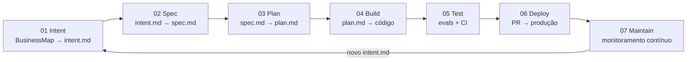

# Esteira Agêntica — AI-native SDLC Mobile

> Transformar o ciclo de desenvolvimento em um loop contínuo onde agentes executam e humanos governam.

---

## O que é um SDLC AI-native?

SDLC (Software Development Lifecycle) é o processo completo de desenvolvimento de software: do problema identificado ao código rodando em produção. O SDLC tradicional é centrado em humanos — pessoas esclarecem o problema, escrevem specs, implementam, revisam e fazem deploy. O fluxo funciona, mas não escala: humanos perdem contexto ao saltar entre tarefas, o conhecimento de plataforma fica na cabeça de especialistas, e cada estágio exige a disponibilidade de alguém específico.

Um SDLC AI-native redistribui esse trabalho. A IA não substitui o humano — ela executa as partes repetíveis e que dependem de síntese de contexto, enquanto humanos se concentram em julgamento, decisão e aprovação. O resultado prático: ciclo mais rápido (menos espera por disponibilidade humana) com qualidade mais consistente (checklists de padrões aplicados automaticamente, sem depender da memória do revisor).

O playbook conceitual desta proposta é o [AI-native SDLC da Anthropic](https://claude.com/blog/the-ai-native-sdlc-playbook), adaptado para o contexto de plataforma mobile com GitHub Copilot Enterprise como runtime.

---

## O Problema

O desenvolvimento mobile enfrenta três gargalos que se ampliam com o crescimento do número de times e repos:

### 1. Conhecimento disperso e inacessível

A plataforma mobile é construída sobre camadas de decisões técnicas: arquitetura de bundle React Native, padrões de navegação, APIs de componentes do design system (BBDS), regras de segurança específicas para mobile, convenções de cada bundle. Esse conhecimento existe — mas está disperso:

- Em comentários de PRs antigos que ninguém vai encontrar
- No `.eslintrc` de cada repo (sem explicação do porquê da regra)
- Na cabeça de dois ou três engenheiros sênior que participaram das decisões originais
- Em documentações no Confluence que já estão desatualizadas após o próximo release do BBDS

Um engenheiro novo leva semanas para absorver esses padrões. Um agente de IA sem esse contexto gera código que viola padrões — tornando o code review humano necessário para correções básicas que a documentação já prevê, não apenas para julgamento real.

### 2. Ciclos longos de feedback

Problemas de qualidade, segurança e compliance são descobertos tarde demais. Um componente BBDS com props incorretas, uma chamada de API sem tratamento de autenticação, um fluxo de navegação fora do padrão do bundle — esses problemas chegam ao code review, ao staging, ou a produção. Quanto mais tarde o problema é encontrado, mais caro: o contexto original se perdeu, o autor passou para outra tarefa, e o reviewer precisa reconstruir o entendimento do que deveria ter sido feito.

A causa não é falta de cuidado — é a ausência de mecanismos para aplicar padrões cedo, de forma automática e consistente.

### 3. Rastro quebrado entre ideia e código

O caminho de um card no BusinessMap até código em produção não tem artefato formal no meio. Decisões são tomadas em conversas de Slack, specs ficam em comentários de PR, e o código não rastreia de volta ao problema original.

As consequências aparecem em incidentes: "Por que esse código existe?" não tem resposta objetiva. On-call precisa reconstruir o contexto do zero. E decisões de especificação que poderiam explicar um comportamento em produção foram perdidas.

---

## A Proposta

Uma esteira de desenvolvimento onde cada estágio é suportado por um agente de IA especializado, rodando no runtime que a organização já tem, gerenciando artefatos versionados em git.

### O que é um "agente" nesse contexto?

No GitHub Copilot Enterprise, um **agente** é uma configuração de comportamento especializado: um conjunto de instruções (via `copilot-instructions.md`) e de conhecimento contextual (via skills SKILL.md) que define como o Copilot age em um determinado estágio do desenvolvimento.

Quando o Product Owner abre o Copilot com um card do BusinessMap e instrui a gerar o intent.md, está usando o "Agente 01". Quando o engenheiro abre com um `spec.md` e o contexto de implementação, está usando o "Agente 04". O agente não é um processo separado rodando em background — é o Copilot contextualizado para um estágio específico do SDLC.

Essa distinção é importante: os agentes desta esteira operam **dentro do fluxo de trabalho existente do desenvolvedor**, no IDE onde ele já está trabalhando.

### Contexto de plataforma

| Dimensão | Escolha | Raciocínio |
|---|---|---|
| **Runtime de IA** | GitHub Copilot Enterprise | Já padronizado; sem novo onboarding ou contrato |
| **Stack alvo** | React Native multi-bundle | Contexto atual da plataforma |
| **Gestão de backlog** | BusinessMap (MCP já existe) | Integração sem desenvolvimento adicional |
| **Design** | Figma — fluxo atual preservado | Design manual continua; MCP pode ser ativado quando dev mode disponível em escala |
| **Design system** | BBDS — obrigatório para novos fluxos | Padrão existente da plataforma |
| **CI/CD** | GitHub Actions (+ Bitrise para mobile) | Infraestrutura existente |

A esteira não substitui engenheiros — move o humano para onde seu julgamento é insubstituível: definição do problema correto, decisões de arquitetura e aprovação de mudanças críticas.

---

## O Loop de 7 Agentes

Cada estágio do SDLC tem um agente responsável. O output de cada estágio é um **artefato versionado** (arquivo Markdown em git) que serve de input para o próximo — criando rastro auditável do card ao código.



O loop se fecha: um incidente detectado pelo Agente 07 em produção gera um `intent.md` que re-entra no pipeline pelo Agente 01. O bug de hoje é a feature de amanhã, com rastreabilidade completa do incidente original ao código que o resolve.

| # | Agente | Input | Output | Gate humano |
|---|---|---|---|---|
| 01 | Intent | Card BusinessMap | `intent.md` | Product Owner faz merge do PR |
| 02 | Spec | `intent.md` + protótipo Figma | `spec.md` + componentes BBDS mapeados | PO + policy owners resolvem flags |
| 03 | Plan | `spec.md` + estado atual do repo | `plan.md` | Engenheiro commita explicitamente |
| 04 | Build | `plan.md` | Código + testes | CI green (testes + lint + evals) |
| 05 | Test | Código + histórico de evals | Eval pass rate + diagnóstico de CI | Threshold configurado pelo tech lead |
| 06 | Deploy | PR + `REVIEW.md` | Review comentado + aprovação | 1 humano + CI green |
| 07 | Maintain | Produção (crashes + jornadas) | `intent.md` de incidente | On-call faz triagem |

### Por que um artefato por estágio?

Cada artefato serve três funções simultâneas:

1. **Input para o próximo agente**: contexto estruturado, não conversa de Slack nem memória humana
2. **Gate de aprovação**: o PR com o artefato é onde o humano exerce seu julgamento consciente
3. **Rastreabilidade**: qualquer linha de código pode ser rastreada até o `intent.md` — e até o card do BusinessMap. "Por que esse código existe?" tem resposta objetiva.

---

## O que são Skills?

Skills são a forma como os agentes recebem conhecimento de domínio especializado — o conhecimento específico desta plataforma que um modelo de IA geral não tem.

Uma skill é um arquivo Markdown (formato SKILL.md) com documentação curada ou gerada automaticamente sobre um assunto específico: a API do design system BBDS, padrões de segurança React Native, convenções de bundle. O GitHub Copilot Enterprise carrega as skills dinamicamente: quando o contexto da sessão menciona um componente BBDS, a skill `bbds-api` é carregada automaticamente com a especificação completa daquele componente.

**Skills versus documentação em Confluence:**

| Dimensão | Confluence | Skills |
|---|---|---|
| Descoberta | Manual — o engenheiro vai buscar | Automática — o Copilot carrega no momento certo |
| Atualização | Manual — depende de alguém lembrar | Automática — CI atualiza após cada release do BBDS |
| Confiabilidade | Pode estar desatualizado | Versionado em git, auditável |
| Para o agente | Não acessível | O conteúdo exato que o agente recebe |

Skills são o mecanismo que transforma "o Copilot conhece React Native em geral" em "o Copilot conhece os padrões específicos desta plataforma e desta versão do BBDS".

---

## Infraestrutura de Conhecimento (pré-requisitos)

Os agentes são tão bons quanto o contexto que recebem. Antes dos agentes entrar em produção, dois bootstraps de conhecimento precisam estar ativos.

### Fase 0 — Conhecimento de Plataforma

O conhecimento de plataforma — padrões de bundle, anti-patterns, convenções — existe hoje de forma dispersa. A Fase 0 o formaliza em skills versionadas.

Cada repo recebe um `copilot-instructions.md` com contexto fundamental: estrutura do bundle, comandos de build/test/lint, allowlist de dependências aprovadas, referências às skills disponíveis. Esse arquivo é o "README para o agente" — o que qualquer engenheiro novo precisaria saber, formalizado em uma instrução permanente.

Skills criadas na Fase 0:
- `platform-standards` — convenções de código, arquitetura de bundle, anti-patterns documentados
- `security` — OWASP React Native, secure storage, cert pinning, padrões de autenticação

**Por que a Fase 0 é bloqueante?** Um agente sem contexto de plataforma gera código que viola padrões internos — e o review humano precisa capturar esses problemas básicos, cancelando o ganho de velocidade. A Fase 0 é o investimento que torna os agentes subsequentes úteis.

**Bootstrap progressivo:** Repos com maior volume de mudanças têm prioridade. O objetivo é ter o nível mínimo em todos os repos ativos em 60 dias.

### Fase 0b — Conhecimento BBDS

O BBDS (design system) tem releases frequentes com mudanças de API: novas props, props deprecated, migration paths. Documentar isso manualmente é insustentável — a documentação manual sempre fica para trás do código real.

A solução é **auto-geração**: o script `extract-bbds-types.ts` usa a biblioteca `ts-morph` para ler diretamente os TypeScript types do BBDS (a fonte da verdade). A partir dos tipos e JSDoc comentários (`@deprecated`, `@default`, descrições), extrai: quais props existem, quais são os tipos, quais valores são default, quais estão deprecated e qual é o migration path. O resultado é o arquivo `bbds-api-reference.md`, gerado automaticamente em CI a cada bump de versão do BBDS — sem lag, sem intervenção manual.

Skills criadas na Fase 0b:
- `bbds-api` — props, tipos, defaults, deprecated + migration paths (auto-gerada em CI)
- `bbds-ux-guidelines` — quando usar / não usar cada componente (curado pelo time de UX, estável entre releases)
- `bbds-patterns` — padrões de composição de telas (curado pela plataforma)

---

## Governança — Nenhum Agente Aprova seu Próprio Output

O princípio central de governança da esteira: cada estágio tem um gate humano explícito antes de avançar. O agente produz o artefato; o humano decide se ele avança.

Isso não é burocracia adicional — é o fluxo de trabalho atual formalizado:

| Gate | Quem aprova | Mecanismo | O que o humano verifica |
|---|---|---|---|
| `intent.md` | Product Owner | Merge do PR no GitHub | O problema certo está sendo resolvido? A prioridade está correta? |
| `spec.md` | PO + policy owners | Merge após flags 🔴 resolvidas | Requisitos corretos? Flags de compliance endereçadas pelos donos das políticas? |
| `plan.md` | Engenheiro responsável | Commit explícito | A estratégia de implementação é viável? Os riscos foram identificados? |
| Código | CI green | Automático (sem humano) | Testes passam, lint ok, evals ok — verificação determinística |
| PR | Copilot Review + 1 humano | Aprovação no GitHub | Findings do Copilot endereçados? Há contexto de negócio que o Copilot não capturou? |
| Deploy prod | Release manager | GitHub environment protection | Timing correto? Rollback planejado? |
| Incidente | On-call | Triagem do intent.md gerado | Hipótese de root cause válida? Qual prioridade? Merge ou dismiss? |

**Por que esse modelo?** O risco de um erro de agente não é uniforme. Um `intent.md` incorreto tem baixo impacto — é só um arquivo Markdown que o PO pode rejeitar. Código incorreto em produção pode causar incidente com usuários reais. Os gates são calibrados ao risco: mais leves no início do pipeline, mais rigorosos no deploy.

**Autonomia conquistada progressivamente.** A esteira começa conservadora. À medida que o pass rate dos evals sobe e a confiança nos agentes cresce, alguns gates podem ser relaxados. O caminho inverso — começar autônomo e adicionar gates após incidente — é muito mais difícil de implementar organizacionalmente.

---

## Evals — Testes para Configuração de Agentes

Agentes são configurados via instrução — o `copilot-instructions.md` e as skills definem o comportamento. Mudanças nessa configuração podem alterar o comportamento do agente, da mesma forma que uma mudança de código pode quebrar uma função. Sem testes, essas mudanças são deploy no escuro.

**Evals são testes para configuração de agentes.** Cada agente tem um conjunto de 20–50 tarefas de avaliação baseadas em casos reais do desenvolvimento mobile:

```
agents/01-intent/evals/tasks/task-001-portabilidade/
├── input/
│   ├── card.json          # card do BusinessMap com campos reais
│   └── context.md         # contexto adicional do produto
└── expected/
    ├── intent.md           # intent.md que deveria ser gerado
    └── validation.json     # critérios de avaliação (campos obrigatórios, schema)
```

Para cada task: um input realista, um expected output, e um grader (script ou rubrica de modelo). O CI roda a eval suite automaticamente quando `copilot-instructions.md` ou uma skill é modificada. Se o pass rate cair abaixo de 85%, o merge é bloqueado.

**Dois tipos de grader:**
- **Code-based**: verifica o output com regex e verificações determinísticas — rápido, sem custo de modelo, para estrutura e schema
- **Model-based**: avalia qualidade semântica com uma rubrica — para critérios que precisam de julgamento ("o diagnóstico é fundamentado?")

**Incidentes de produção viram evals permanentes.** Quando um bug chega a produção que o agente deveria ter prevenido, o caso vira uma task de eval. "Não pode acontecer de novo" tem implementação concreta — não apenas uma promessa.

**Pass rate global ≥ 85% = esteira funcional.** Abaixo disso, o pipeline para.

---

## Estrutura do Repositório

```
sdlc-agentico/
├── .github/
│   ├── copilot-instructions.md     # contexto principal — carregado em toda sessão do Copilot
│   ├── skills/                     # skills de conhecimento (platform, security, BBDS)
│   │   ├── platform-standards/
│   │   ├── security/
│   │   ├── bbds-api/               # auto-gerada via ts-morph
│   │   ├── bbds-ux-guidelines/
│   │   └── bbds-patterns/
│   └── workflows/
│       ├── eval-suite.yml          # roda evals de todos os agentes em CI
│       ├── bbds-api-sync.yml       # auto-geração bbds-api-reference a cada bump de versão
│       └── monitoring.yml          # cron de monitoramento (Agente 07)
├── agents/                         # configuração + evals de cada agente (01 a 07)
│   ├── 01-intent/
│   ├── 02-spec/
│   └── ...
├── platform-knowledge/
│   ├── bbds-api-reference.md       # gerado automaticamente — não editar manualmente
│   └── bbds-ux-guidelines.yaml     # curado pelo time de UX
├── templates/                      # artefatos-template (intent, spec, plan, REVIEW, bands)
├── scripts/
│   └── extract-bbds-types.ts       # ts-morph — gera bbds-api-reference.md
├── evals/                          # framework e guia de evals
└── docs/                           # esta documentação
    ├── architecture.md
    ├── decisions.md
    └── agents/                     # documentação detalhada de cada agente
        ├── 01-intent.md
        ├── 02-spec.md
        └── ...
```

---

## Leitura Recomendada

Se você está chegando agora, a sequência recomendada:

| Etapa | Documento | O que você vai encontrar |
|---|---|---|
| 1 | [`docs/architecture.md`](docs/architecture.md) | Como as entidades se conectam — sistemas externos, skills, cadeia de artefatos, monitoramento |
| 2 | [`docs/decisions.md`](docs/decisions.md) | Por que cada decisão foi tomada — contexto, alternativas, justificativa |
| 3 | `docs/agents/` | Especificação detalhada de cada agente: fluxo completo, inputs/outputs com schema, evals, governança, métricas |
| 4 | [`plan.md`](plan.md) | Plano de implementação técnico completo (fonte da verdade para execução) |

Para quem quer entender a referência conceitual da qual esta proposta foi derivada: [AI-native SDLC Playbook — Anthropic](https://claude.com/blog/the-ai-native-sdlc-playbook).
