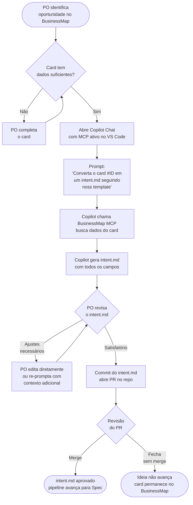

# Agente 01 — Intent

**Estágio:** Plan  
**Runtime:** GitHub Copilot Chat + BusinessMap MCP (VS Code agent mode)  
**Responsável pela aprovação:** Product Owner

> Transforma um card do BusinessMap em um artefato estruturado (`intent.md`) em minutos. Força a articulação explícita do problema antes de qualquer solução.

---

## O que muda

Hoje, a passagem de uma ideia para uma especificação começa implícita — reuniões, Slack, suposições. O `intent.md` cria um ponto de partida formal: o problema é declarado, as perguntas abertas são listadas, os sistemas afetados são identificados. Qualquer pessoa que pegar o trabalho depois entende o contexto sem precisar rastrear conversas.

O agente não substitui o julgamento do Product Owner — ele elimina o trabalho de formatação e garante que nenhum campo crítico seja esquecido.

---

## Pré-requisitos

- BusinessMap MCP configurado e autenticado no VS Code
- Template `templates/intent.md` disponível no repo
- `copilot-instructions.md` referenciando o template de intent

---

## Inputs

### Card do BusinessMap

O agente busca os seguintes dados do card via MCP:

| Campo do card | Usado no intent.md como | Obrigatório no card? |
|---|---|---|
| Título | `title` | Sim |
| Descrição / história de usuário | Base para `problem` e `expected_outcome` | Sim |
| Tipo (feature, bug, improvement) | Contexto para `problem` | Sim |
| Labels / tags | Subsídio para `systems_involved` e `constraints` | Recomendado |
| Responsável | `author` | Sim |
| Comentários e discussões | Subsídio para `open_questions` | Opcional |
| Épico associado | `related_intents` (quando há dependências) | Opcional |
| Estimativa de esforço | `constraints` (quando há deadline implícita) | Opcional |

**Se o card estiver incompleto:** O agente gera o `intent.md` com os campos disponíveis e preenche `open_questions` com as lacunas detectadas. O PO completa antes de commitar.

---

## Output — `intent.md`

### Schema completo

```markdown
---
title: "[Título descritivo da iniciativa]"
source_card: "[URL do card no BusinessMap]"
author: "[nome do PO]"
created_at: "YYYY-MM-DD"
template_version: "1.0"
status: draft | approved
related_intents: []    # opcional — links para intent.mds relacionados
---

## Problema

[Descrição em 1-3 parágrafos: qual dor existe hoje, quem sente, qual o impacto mensurável]

## Outcome Esperado

[O que deve ser verdade após a entrega — mensurável, não "melhorar a experiência"]
- Métrica 1: de X para Y
- Métrica 2: ...

## Usuários Afetados

- Segmento: [ex: usuários PF na jornada de contratação de crédito]
- Volume estimado: [ex: ~50k usuários/semana]

## Sistemas Envolvidos

- `[nome-do-bundle]` — [responsabilidade no contexto desta iniciativa]
- `[serviço-backend]` — [endpoint/domínio afetado]

## Constraints

- **Técnicas**: [ex: deve funcionar offline, deve suportar Android 8+]
- **Regulatórias**: [ex: dados de PF sujeitos à LGPD]
- **De negócio**: [ex: não pode impactar a jornada de contratação existente]

## Perguntas Abertas

1. [Pergunta que precisa ser respondida antes de escrever a spec]
2. [...]

## Notas

[Campo livre para contexto adicional que não cabe nas seções acima]
```

### Campos obrigatórios para aprovação
`title`, `source_card`, `author`, `created_at`, `problem` (≥1 parágrafo), `expected_outcome` (≥1 métrica), `affected_users`, `systems_involved` (≥1 sistema), `open_questions` (pode ser lista vazia se não houver, mas seção deve existir).

---

## Fluxo



---

## Evals

### Por que evals para este agente

Sem evals, mudanças no template de `intent.md` ou no prompt do agente podem fazer com que campos obrigatórios deixem de ser preenchidos, ou que o problema declarado não corresponda ao card. Isso só seria detectado quando o Agente 02 (Spec) tentar gerar uma spec a partir de um intent incompleto — tarde demais.

### Estrutura de uma task de eval

Cada task é um diretório em `agents/01-intent/evals/tasks/` com dois arquivos:

```
agents/01-intent/evals/tasks/
└── task-001-onboarding-digital/
    ├── input.json          # dados simulados do card BusinessMap
    └── expected.md         # intent.md esperado (ground truth)
```

**`input.json`** — simula o retorno do MCP:
```json
{
  "task_id": "intent-001",
  "description": "Feature: onboarding digital para novos usuários PF",
  "card": {
    "id": "BM-4521",
    "title": "Onboarding digital para PF",
    "description": "Usuários precisam criar conta sem ir à agência...",
    "type": "feature",
    "labels": ["bundle-onboarding", "lgpd"],
    "assignee": "Maria PO",
    "comments": ["Precisa suportar biometria facial"]
  }
}
```

**`expected.md`** — intent.md que um PO experiente produziria para este card (ground truth).

### Tipos de graders

#### Code-based (rápidos, determinísticos)

```python
# graders/schema_check.py
import re, yaml

def grade(output_md: str) -> dict:
    # Verifica campos obrigatórios no frontmatter
    required_fields = ['title', 'source_card', 'author', 'created_at']
    frontmatter = yaml.safe_load(output_md.split('---')[1])
    missing = [f for f in required_fields if not frontmatter.get(f)]

    # Verifica seções obrigatórias
    required_sections = ['## Problema', '## Outcome Esperado',
                         '## Usuários Afetados', '## Sistemas Envolvidos',
                         '## Perguntas Abertas']
    missing_sections = [s for s in required_sections if s not in output_md]

    # Verifica link ao card BusinessMap
    has_card_link = bool(re.search(r'source_card:.*BM-\d+', output_md))

    passed = not missing and not missing_sections and has_card_link
    return {
        "passed": passed,
        "missing_fields": missing,
        "missing_sections": missing_sections,
        "has_card_link": has_card_link
    }
```

#### Model-based (rubrica semântica)

Roda o Copilot como juiz com o seguinte prompt:

```
Avalie o intent.md abaixo em relação ao card de origem.

Card original: {card_data}
intent.md gerado: {output_md}

Avalie cada critério de 1 a 5:

1. CORRESPONDÊNCIA DO PROBLEMA (1-5)
   O problema declarado corresponde ao problema do card?
   1 = completamente diferente | 5 = corresponde com precisão

2. MENSURABILIDADE DO OUTCOME (1-5)
   O outcome esperado é mensurável e verificável?
   1 = subjetivo ("melhorar a UX") | 5 = métrica específica com baseline e target

3. COMPLETUDE DE SISTEMAS (1-5)
   Os sistemas listados cobrem todos os impactados?
   1 = sistemas óbvios faltando | 5 = completo

4. QUALIDADE DAS PERGUNTAS ABERTAS (1-5)
   As perguntas são relevantes e bloqueadoras?
   1 = triviais ou ausentes | 5 = todas relevantes, específicas e não-respondidas no card

Formato da resposta:
{ "scores": { "problem": N, "outcome": N, "systems": N, "questions": N }, "notes": "..." }
```

**Critério de aprovação:** score médio ≥ 3.5 em todos os critérios, nenhum critério < 2.

### Como rodar os evals

**Localmente** (antes de commitar mudança em template ou prompt):
```bash
npm run eval -- --agent=01-intent
```

**Em CI** — disparado automaticamente por `eval-suite.yml` quando:
- `templates/intent.md` é alterado
- `agents/01-intent/` é alterado
- `.github/copilot-instructions.md` é alterado

### Como criar uma nova task a partir de um incidente

1. Identifique o caso que falhou (ex: agente não preencheu `systems_involved` para cards de infra)
2. Crie `agents/01-intent/evals/tasks/task-NNN-descricao/input.json` com o card que causou o problema
3. Crie `expected.md` com o intent.md correto que deveria ter sido gerado
4. Rode os evals para confirmar que a nova task falha no estado atual
5. Corrija o prompt/template até a task passar
6. Commite a task junto com a correção — ela permanece na suite para prevenir regressão

### Interpretando os resultados

| Pass rate | Interpretação | Ação |
|---|---|---|
| ≥ 90% | Agente funcionando bem | Monitorar tendência |
| 80–90% | Casos específicos falhando | Investigar tasks que falham, ajustar prompt |
| 70–80% | Degradação significativa | Bloquear merge, investigar mudanças recentes |
| < 70% | Agente quebrado | Reverter última mudança de template/prompt |

---

## Governança

### Aprovador e autoridade

**Product Owner** — é o responsável pela definição do problema no BusinessMap. Tem autoridade e contexto para validar se o `intent.md` captura corretamente a intenção do negócio.

### O que o PO está revisando

O PO não está revisando formatação (o agente cuida disso) — está validando substância:

1. **O problema declarado é o problema certo?** — O agente pode ter interpretado o card de forma literal mas incorreta. O PO conhece o contexto que não estava no card.
2. **O outcome é realmente mensurável?** — "Melhorar a experiência" não conta. Precisa de baseline e target.
3. **Os sistemas listados estão completos?** — Principalmente sistemas que o card não menciona explicitamente mas que serão afetados.
4. **As perguntas abertas são as perguntas certas?** — Há perguntas bloqueadoras que o agente não identificou? Há perguntas triviais que podem ser removidas?

### Mecanismo de aprovação

- **Merge do PR** = aprovação formal. O `intent.md` entra no pipeline.
- **Fechar o PR sem merge** = rejeição. A ideia não avança. O card no BusinessMap permanece na coluna original.
- **Comentário no PR + re-geração** = iteração. PO aponta o problema, o agente re-gera, um novo commit é adicionado ao PR.

O PR é o registro da decisão — o histórico de commits mostra quantas iterações foram necessárias e quais ajustes foram feitos.

### Quem não pode aprovar

O próprio agente não faz merge do PR. Apenas humanos com acesso de write ao repo podem fazer merge — enforçado por branch protection no GitHub.

### Trilha de auditoria

O merge do PR registra: quem aprovou, quando, e qual versão do template foi usada (no frontmatter do `intent.md`). Se o `intent.md` for alterado depois do merge, o git log mostra quem alterou e por quê.

---

## Medição

### Conceito: Leading vs. Lagging

**Métricas leading** são sinais antecipados — indicam tendências antes de impactarem o resultado final. Permitem correção de curso precocemente.

**Métricas lagging** validam resultados reais — confirmam se o que foi feito funcionou. São mais lentas de se mover, mas mais definitivas.

Para o Agente 01, o que queremos saber é: *o agente está produzindo intents que de fato traduzem boas ideias em especificações trabalháveis?*

### Métricas Leading

#### Tempo do card → `intent.md` mergeado

- **Por que foi escolhida**: Se esse tempo está alto, o funil de ideias está congestionado antes mesmo de entrar no pipeline técnico. Indica ou que o PO está com dificuldade de usar o agente, ou que o template está gerando muita revisão.
- **O que indica quando sobe**: Fricção no processo de geração ou aprovação. Investigar se o agente está gerando campos incorretos frequentemente.
- **Fonte de dados**: GitHub API — `created_at` do PR vs. `merged_at`
- **Como medir**:
  ```bash
  gh pr list --label "intent" --state merged \
    --json number,createdAt,mergedAt \
    | jq '[.[] | {pr: .number, hours: ((.mergedAt | fromdateiso8601) - (.createdAt | fromdateiso8601)) / 3600}]'
  ```
- **Frequência**: Semanal (média móvel de 4 semanas)
- **Target**: < 4 horas | Alarme: > 24 horas consistentemente

#### Taxa de iterações por intent (commits após geração inicial)

- **Por que foi escolhida**: Indica quantas vezes o agente precisou ser corrigido antes da aprovação. Alto número = o prompt/template precisa de ajuste.
- **Como medir**: Número de commits no PR de intent antes do merge (excluindo o commit inicial)
- **Target**: < 2 commits por PR | Alarme: média > 3

### Métricas Lagging

#### Taxa de `intent.md` que requerem revisão após a etapa de Spec

- **Por que foi escolhida**: Um `intent.md` aprovado que precisa ser reaberto durante o stage de Spec indica que o PO aprovou algo incompleto. O agente gerou um intent que passou no gate mas não estava pronto.
- **O que indica quando sobe**: Ou o agente está gerando `open_questions` insuficientes, ou o PO está aprovando sem revisar adequadamente.
- **Fonte de dados**: Git log — commits em `intent.md` feitos após a criação do `spec.md` correspondente
- **Como medir**: Query no git log por arquivos de intent alterados após a data do primeiro commit de spec associado
- **Frequência**: Mensal
- **Target**: < 10% dos intents | Alarme: > 25%

#### NPS interno do PO com o agente (qualitativo trimestral)

- **Por que foi escolhida**: Métricas quantitativas capturam o quê, mas não o porquê. Uma pergunta direta ao PO ("o agente está tornando seu trabalho mais fácil?") captura fricção que os números não mostram.
- **Como medir**: Formulário curto (3 perguntas, escala 1-5) enviado por email a cada trimestre
- **Target**: ≥ 4/5 | Alarme: < 3/5
