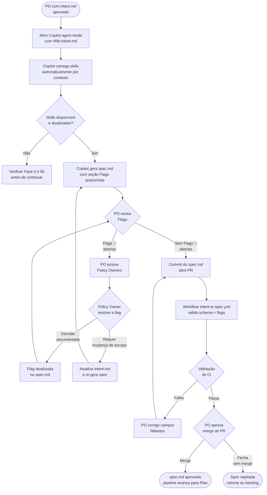

# Agente 02 — Spec

**Estágio:** Design  
**Runtime:** GitHub Copilot agent mode + skills de política + skills BBDS  
**Responsável pela aprovação:** Product Owner + Policy Owners (flags)

> Transforma um `intent.md` aprovado em uma especificação técnica completa (`spec.md`), com políticas aplicadas durante a geração — não descobertas em revisão semanas depois. Mapeia componentes BBDS por tela antes de qualquer implementação.

---

## O que muda

Hoje, a spec vive em Confluence, em reuniões ou na cabeça do dev. O agente força que: (1) políticas de segurança e compliance sejam verificadas durante a geração da spec, não após; (2) os componentes BBDS sejam escolhidos com base em critérios de UX documentados, não por preferência individual; (3) o protótipo Figma seja referenciado formalmente, criando vínculo rastreável entre design e spec.

O Copilot carrega as skills relevantes automaticamente — o PO não precisa saber quais políticas existem para que elas sejam aplicadas.

---

## Pré-requisitos

- **Fase 0b ativa**: skills `bbds-ux-guidelines` e `bbds-patterns` publicadas em `.github/skills/`
- `bbds-api-reference.md` gerado e disponível em `platform-knowledge/`
- Skills `security` e `platform-standards` publicadas (Fase 0)
- `templates/spec.md` disponível

---

## Inputs

### `intent.md` aprovado

O agente lê o arquivo inteiro. Os campos mais relevantes para a geração da spec:

| Campo do intent.md | Uso na spec |
|---|---|
| `problem` | Contexto para requisitos funcionais — o agente gera requisitos que resolvem *este* problema |
| `expected_outcome` | Critérios de aceitação — cada outcome precisa de um critério verificável |
| `systems_involved` | Scope de sistemas — define onde a spec se aplica |
| `constraints` | Constraints que entram diretamente na spec (técnicas, regulatórias, de negócio) |
| `open_questions` | Flags de incerteza — se ainda há perguntas abertas, a spec as documenta como pendências |

### Skills carregadas automaticamente

O Copilot carrega skills com base na `description` no SKILL.md e no contexto do pedido:

| Skill | Quando é carregada | O que adiciona à spec |
|---|---|---|
| `security` | Qualquer feature com autenticação, dados de usuário, pagamentos | Requisitos de segurança, flags de OWASP, constraints de armazenamento |
| `platform-standards` | Toda spec de feature mobile | Constraints de arquitetura, padrões de bundle, anti-patterns |
| `bbds-ux-guidelines` | Qualquer menção a UI, telas, fluxo | Critérios de uso de componentes BBDS por tela |
| `bbds-patterns` | Geração de nova tela ou fluxo | Padrões de composição aprovados |
| `compliance` *(Fase 2)* | Dados de PF, saúde, financeiros | Constraints LGPD, WCAG, data residency |

### Protótipo Figma

Referência manual — o link do arquivo Figma é incluído no frontmatter do `spec.md`. O agente não acessa o Figma diretamente (requer dev mode em escala). O PO informa quais telas do protótipo são relevantes.

---

## Output — `spec.md`

### Schema completo

```markdown
---
title: "[mesmo título do intent.md]"
intent_ref: "[link ao intent.md]"
figma_ref: "[link ao arquivo Figma + nome da tela/frame]"
author: "[PO]"
created_at: "YYYY-MM-DD"
template_version: "1.0"
status: draft | approved
skills_used: [security@v1.2, platform-standards@v2.0, bbds-ux-guidelines@v1.5]
---

## Resumo

[1-2 parágrafos descrevendo o que será construído e por quê — derivado do intent.md]

## Requisitos Funcionais

### RF-01: [Nome]
**Descrição**: [O que o sistema deve fazer]
**Critério de aceitação**: [Condição verificável: "dado X, quando Y, então Z"]
**Tela(s) afetada(s)**: [NomeDaTela — link no Figma]

### RF-02: [...]

## Requisitos Não-Funcionais

- **Performance**: [ex: tempo de resposta do endpoint < 300ms no P95]
- **Offline**: [ex: funciona sem conexão? dados cacheados por quanto tempo?]
- **Compatibilidade**: [versões mínimas Android/iOS]
- **Acessibilidade**: [nível WCAG mínimo]

## Mapeamento de Componentes BBDS por Tela

### [NomeDaTela]

| Elemento de UI | Componente BBDS | Justificativa (bbds-ux-guidelines) |
|---|---|---|
| Botão de confirmação | `Button` variant="primary" | Ação primária, 1 por tela — conforme use_when |
| Lista de opções | `ActionList` | > 3 ações em sequência — avoid_when de Button |
| Campo de texto | `TextInput` type="text" | Formulário padrão |

**Atenção**: Componentes listados foram validados contra `bbds-api-reference.md` v[X.Y]. Props usadas são atuais.

## Constraints

### Técnicas
- [...]

### Regulatórias
- [ex: Dados de CPF não podem ser armazenados em AsyncStorage — LGPD + segurança]

### De negócio
- [ex: Não pode quebrar o fluxo de contratação existente]

## Critérios de Aceitação (consolidados)

- [ ] RF-01: [critério verificável]
- [ ] RF-02: [...]
- [ ] Todos os componentes BBDS usados conforme bbds-ux-guidelines
- [ ] Sem dados sensíveis em AsyncStorage
- [ ] Compatível com Android 8+ e iOS 13+

## Flags

> Flags são pendências ou riscos que precisam ser endereçados antes do merge deste spec.
> Cada flag deve ser resolvida (com decisão documentada) ou explicitamente aceita como risco conhecido.

### 🔴 FLAG-01: [título] *(Important — bloqueia merge)*
**Descrição**: [o que está em aberto ou em conflito]
**Responsável**: [quem deve resolver]
**Resolução**: [campo preenchido após resolução]

### 🟡 FLAG-02: [título] *(Warning — não bloqueia, mas deve ser documentada)*
```

### Campos obrigatórios para aprovação
`intent_ref`, `figma_ref`, `skills_used`, todos os RF com critério de aceitação, mapeamento BBDS (se houver UI), seção `## Flags` (pode estar vazia, mas deve existir e todas as flags 🔴 devem estar resolvidas).

---

## Fluxo



---

## Evals

### Por que evals para este agente

O Agente 02 aplica políticas de segurança, compliance e UX durante a geração. Sem evals, uma mudança na skill `security` pode fazer com que features críticas sejam especificadas sem as constraints corretas. O risco só seria descoberto em produção.

### Estrutura de uma task de eval

```
agents/02-spec/evals/tasks/
└── task-001-onboarding-digital/
    ├── input/
    │   ├── intent.md           # intent.md aprovado (input para o agente)
    │   └── figma_context.md    # descrição textual das telas do protótipo
    └── expected/
        ├── spec.md             # spec esperada (ground truth)
        └── flags.json          # flags esperadas com severidades
```

**`flags.json`** — lista de flags que devem aparecer no spec.md gerado:
```json
{
  "expected_flags": [
    {
      "id": "FLAG-01",
      "severity": "Important",
      "topic": "LGPD",
      "reason": "Feature coleta CPF — constraint de armazenamento deve estar explícita"
    }
  ],
  "unexpected_flags": [
    "FLAG sobre performance — não há requisito de performance crítica neste intent"
  ]
}
```

### Tipos de graders

#### Code-based

```python
# graders/spec_schema_check.py
import yaml, re

def grade(output_md: str, expected_flags: dict) -> dict:
    frontmatter = yaml.safe_load(output_md.split('---')[1])

    # Campos obrigatórios no frontmatter
    required = ['intent_ref', 'figma_ref', 'skills_used', 'author']
    missing_fields = [f for f in required if not frontmatter.get(f)]

    # Seções obrigatórias
    required_sections = [
        '## Requisitos Funcionais',
        '## Mapeamento de Componentes BBDS',
        '## Critérios de Aceitação',
        '## Flags'
    ]
    missing_sections = [s for s in required_sections if s not in output_md]

    # Critérios de aceitação verificáveis (devem conter "dado", "quando" ou "então")
    ac_pattern = re.findall(r'Critério de aceitação.*?(?=###|\Z)', output_md, re.DOTALL)
    weak_criteria = [ac for ac in ac_pattern if not any(
        kw in ac.lower() for kw in ['dado', 'quando', 'então', 'deve', 'resultado']
    )]

    # Componentes BBDS referenciados existem no bbds-api-reference?
    bbds_components = re.findall(r'`(\w+)`.*variant=', output_md)
    with open('platform-knowledge/bbds-api-reference.md') as f:
        api_ref = f.read()
    invalid_components = [c for c in bbds_components if c not in api_ref]

    # Flags Important sem resolução
    open_critical_flags = re.findall(r'🔴.*?(?=###|\Z)', output_md, re.DOTALL)
    unresolved = [f for f in open_critical_flags if 'Resolução:' not in f or
                  'pendente' in f.lower()]

    return {
        "passed": not any([missing_fields, missing_sections, weak_criteria,
                           invalid_components, unresolved]),
        "missing_fields": missing_fields,
        "missing_sections": missing_sections,
        "weak_acceptance_criteria": len(weak_criteria),
        "invalid_bbds_components": invalid_components,
        "open_critical_flags": len(unresolved)
    }
```

#### Model-based (rubrica semântica)

```
Avalie o spec.md abaixo em relação ao intent.md de origem.

intent.md: {intent_content}
spec.md gerado: {spec_content}

Critérios (1-5 cada):

1. COBERTURA DO INTENT (1-5)
   Todos os pontos do intent.md estão endereçados na spec?
   1 = partes importantes do intent ignoradas | 5 = cobertura completa

2. QUALIDADE DOS CRITÉRIOS DE ACEITAÇÃO (1-5)
   Os critérios são verificáveis de forma objetiva?
   1 = critérios subjetivos ("funcionar bem") | 5 = todos testáveis como dado/quando/então

3. APLICAÇÃO DE POLÍTICAS (1-5)
   As políticas de segurança/plataforma foram aplicadas (não apenas mencionadas)?
   1 = mencionadas mas não como constraints reais | 5 = todas traduzidas em requisitos concretos

4. PERTINÊNCIA DAS FLAGS (1-5)
   As flags levantadas são genuínas pendências ou riscos?
   1 = flags triviais ou ausentes | 5 = todas relevantes e acionáveis

5. ADEQUAÇÃO DOS COMPONENTES BBDS (1-5)
   Os componentes escolhidos seguem bbds-ux-guidelines (use_when/avoid_when)?
   1 = componentes incorretos para o contexto | 5 = todos alinhados com as guidelines
```

**Critério de aprovação:** ≥ 3.5 em todos os critérios, nenhum < 2.

### Como rodar

```bash
npm run eval -- --agent=02-spec
```

Disparado em CI por mudanças em: `templates/spec.md`, `.github/skills/security/`, `.github/skills/bbds-*/`, `agents/02-spec/`.

### Criando tasks de regressão

Toda vez que um `spec.md` aprovado for descoberto com um problema durante o build (componente BBDS incorreto, constraint de segurança faltando), criar a task correspondente:
1. Copiar o `intent.md` que gerou o spec problemático → `input/intent.md`
2. Criar o `spec.md` correto que deveria ter sido gerado → `expected/spec.md`
3. Verificar que o grader code-based detecta o problema no spec original
4. Corrigir o prompt/skill e validar que a task passa

---

## Governança

### Aprovadores e autoridade

**Product Owner** — valida que a spec resolve o problema correto e que os critérios de aceitação fazem sentido para o negócio.

**Policy Owners** — validam as flags específicas da sua área:
- Flags de segurança → time de segurança
- Flags de LGPD/compliance → jurídico/compliance *(Fase 2)*
- Flags de BBDS → UX lead (para casos de componente não existente ou uso incomum)

### O que cada aprovador está revisando

**PO revisa:**
- A spec resolve o problema declarado no intent?
- Os critérios de aceitação são verificáveis (não subjetivos)?
- O escopo está correto (nem demais, nem de menos)?

**Policy Owners revisam (por flag específica):**
- A constraint proposta é a forma correta de resolver o risco?
- A flag pode ser dispensada (risco aceito formalmente)?

### Mecanismo de flags

Flags são o mecanismo de colaboração entre o Agente 02 e os policy owners. O fluxo:
1. Agente gera flag 🔴 com responsável sugerido
2. PO notifica o policy owner (via mention no PR)
3. Policy owner comenta no PR com a decisão
4. PO atualiza o campo `Resolução` na flag
5. Somente após todas as flags 🔴 resolvidas, o merge é possível

Flags 🟡 não bloqueiam o merge mas devem ser documentadas — o policy owner confirma que viu e aceita o risco.

### Quem não pode aprovar

O agente não faz merge. Um dev do mesmo bundle não pode ser o único aprovador de uma flag de segurança — requer o time de segurança.

### Trilha de auditoria

O frontmatter do `spec.md` registra `skills_used` com versão — qualquer revisor futuro sabe exatamente quais políticas estavam vigentes quando a spec foi gerada. Flags e resoluções ficam no histórico de PR.

---

## Medição

### Métricas Leading

#### Tempo entre `intent.md` e `spec.md` mergeados

- **Por que foi escolhida**: Captura o tempo gasto em resolução de flags e iterações de review. Alto tempo indica ou muitas flags abertas, ou PO sem acesso fácil aos policy owners.
- **O que indica quando sobe**: Gargalo em resolução de flags. Investigar se policy owners estão respondendo; se as flags geradas são genuínas ou ruidosas (agente levantando flags desnecessárias).
- **Como medir**:
  ```bash
  # PRs de spec abertos e mergeados, calcula duração
  gh pr list --label "spec" --state merged --json createdAt,mergedAt \
    | jq '[.[] | (.mergedAt | fromdateiso8601) - (.createdAt | fromdateiso8601)] | add / length / 3600'
  ```
- **Frequência**: Semanal
- **Target**: < 1 dia | Alarme: > 3 dias consistentemente

#### Proporção de specs geradas com flags 🔴

- **Por que foi escolhida**: Indica quantas features têm riscos que precisam de atenção explícita. Muito alto = agente levantando falsos positivos (desgasta policy owners). Muito baixo = agente pode estar perdendo riscos reais.
- **Como medir**: Contar specs com pelo menos uma flag 🔴 no momento do merge / total de specs
- **Target**: 20–40% (esperado — features com dados sensíveis devem levantar flags)

### Métricas Lagging

#### Rework no spec após o build começar

- **Por que foi escolhida**: Um spec aprovado que precisa ser reaberto durante o build indica que o agente especificou algo incorretamente (componente BBDS que não existe, constraint técnica impossível) ou que o PO aprovou sem revisar adequadamente.
- **O que indica quando sobe**: Spec sendo aprovada com problemas que só aparecem na implementação. Investigar se os graders code-based estão capturando os casos.
- **Como medir**: Commits em arquivos `spec.md` feitos após o primeiro commit do `plan.md` correspondente
  ```bash
  git log --all --pretty=format:"%H %aI %s" -- "**/spec.md" \
    | grep -f <(git log --all --pretty=format:"%aI" -- "**/plan.md") # simplificado
  ```
- **Frequência**: Mensal
- **Target**: < 10% dos specs | Alarme: > 20%

#### Taxa de componentes BBDS incorretos detectados em code review

- **Por que foi escolhida**: Se o Agente 06 (Deploy) ou o reviewer humano estão sinalizando componentes BBDS incorretos em features que passaram pelo Agente 02, indica que o mapeamento de componentes na spec não está sendo validado.
- **Fonte de dados**: Tags nos comentários de code review (ex: label "bbds-violation")
- **Target**: < 5% das features com UI | Alarme: > 15%
