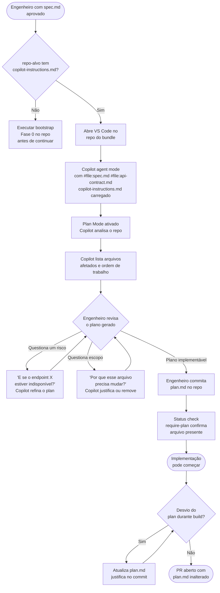

# Agente 03 — Plan

**Estágio:** Planning  
**Runtime:** GitHub Copilot agent mode + Plan Mode nativo  
**Responsável pela aprovação:** Engenheiro (commit explícito)

> Transforma um `spec.md` aprovado em um plano de implementação concreto (`plan.md`) — lista de arquivos que mudam, ordem de trabalho, riscos identificados, e critérios de "pronto". Nenhuma implementação começa sem um plano escrito aprovado.

---

## O que muda

Hoje, o planejamento da implementação é informal — o dev lê a spec e começa a codar. O conhecimento de quais arquivos serão afetados, quais dependências existem, quais riscos há, fica na cabeça do dev. Se outro engenheiro precisar continuar o trabalho, recomeça do zero.

O `plan.md` formaliza esse processo: o engenheiro usa o Copilot em Plan Mode para gerar um plano explícito, revisa e refina com o próprio Copilot (questionando riscos e alternativas), e commita o plano antes de qualquer linha de código. O plano vira parte do histórico do PR.

---

## Pré-requisitos

- `spec.md` mergeado e disponível no repo
- `api-contract.md` mergeado e disponível no repo (gerado pelo Agente 02)
- `.github/copilot-instructions.md` do repo-alvo deve existir (gerado na Fase 0)
- Status check `require-plan` configurado no branch protection do repo-alvo
- Git hooks locais instalados (husky/lefthook) para feedback imediato no dev

---

## Inputs

### `spec.md` aprovado

O agente lê a spec inteira, mas foca em:

| Campo do spec.md | Uso no plan.md |
|---|---|
| `Requisitos Funcionais` (RF-XX) | Cada RF vira um ou mais itens de trabalho no plan |
| `Mapeamento de Componentes BBDS` | Identifica quais telas/componentes serão criados ou alterados |
| `Constraints técnicas` | Informa decisões de implementação (ex: caching strategy, versão mínima de OS) |
| `Sistemas Envolvidos` | Define o escopo de repos/bundles afetados |
| `Critérios de Aceitação` | Orienta a estratégia de testes do plan |

### `api-contract.md`

O agente lê o `api-contract.md` para planejar a estrutura de adapters necessária:

| Campo do api-contract.md | Uso no plan.md |
|---|---|
| Endpoints classificados como `novo` | Planejar criação de `<Feature>Service.ts` (interface), `<Feature>ServiceMock.ts`, `<Feature>ServiceImpl.ts` (placeholder), `index.ts` (selector de feature flag) |
| Endpoints classificados como `extensão` | Planejar atualização do adapter existente + novo mock |
| Endpoints classificados como `reutilizar` | Sem novo adapter necessário — apenas referenciar o existente |

### `.github/copilot-instructions.md` do repo-alvo

Este arquivo é o "contexto do bundle" — o Copilot o carrega automaticamente. Contém:
- Nome e responsabilidade do bundle
- Arquitetura interna (pastas, padrões de nomenclatura)
- Comandos de build, test e lint
- Anti-patterns conhecidos deste repo específico
- Dependências críticas e libs aprovadas

**Sem este arquivo, o Plan Mode opera sem contexto do repo — alto risco de plan incorreto.** O CI bloqueia merge via status check `require-plan` se o arquivo não existir.

---

## Output — `plan.md`

### Schema completo

```markdown
---
title: "[mesmo título do spec.md]"
spec_ref: "[link ao spec.md]"
author: "[engenheiro]"
created_at: "YYYY-MM-DD"
repo: "[nome do repo/bundle]"
estimated_effort: "[P | M | G | GG]"  # estimativa do próprio engenheiro após revisar o plan
template_version: "1.0"
status: draft | approved
---

## Resumo do que será feito

[1-2 parágrafos descrevendo a implementação — não o problema (isso está no spec)]

## Arquivos que mudam

### Criados
- `src/screens/ConfirmacaoDadosScreen.tsx` — nova tela de confirmação (RF-02)
- `src/components/FormPessoal/index.tsx` — novo componente de formulário

### Modificados
- `src/navigation/AppNavigator.tsx` — adicionar nova rota
- `src/services/creditApi.ts` — novo endpoint POST /credit/validate

### Arquivos que NÃO mudam (e por quê)
- `src/screens/HomeScreen.tsx` — impactado pelo RF-01 mas mudança será em PR separado

## Ordem de trabalho

1. **[nome do item]** — [descrição breve]
   - Arquivos: `[lista]`
   - Depende de: nada (pode começar)
   - Critério de pronto: [o que torna este item completo]

2. **[nome do item]** — [descrição breve]
   - Arquivos: `[lista]`
   - Depende de: item 1 (usa o componente criado)
   - Critério de pronto: [...]

## Estratégia de Testes

- **Unitários**: `FormPessoal.test.tsx` — validação de campos, estados de erro
- **Integração**: mock do endpoint `/credit/validate` — cenários de sucesso e 503
- **E2E** (se aplicável): fluxo completo de contratação com Detox
- **Não testado automaticamente**: comportamento de biometria (requer device real — documentar em QA manual)

## Riscos Identificados

### 🔴 Risco alto — [título]
**Descrição**: [o que pode dar errado e qual o impacto]
**Mitigação**: [o que será feito para reduzir o risco]
**Plano B**: [o que fazer se a mitigação não funcionar]

### 🟡 Risco médio — [título]
**Descrição**: [...]
**Mitigação**: [...]

## Dependências de Backend

> Gerado a partir do `api-contract.md`. Informa ao engenheiro quais adapters precisam ser criados antes de implementar as telas.

| Endpoint | Classificação | Adapter necessário | Status |
|---|---|---|---|
| `POST /api/v1/recurso` | `novo` | `<Feature>Service.ts` + mock + index | a criar |
| `GET /api/v1/outro` | `reutilizar` | nenhum | — |

- Endpoints `novo` ou `extensão` → criar estrutura completa de adapter em `services/<feature>/`
- Feature flags correspondentes devem ser configuradas como `false` até o backend real existir
- Telas importam apenas `<Feature>Service.ts` (interface) — nunca o mock ou impl diretamente

## Dependências Externas

- `[serviço/repo]`: necessário para [item X]. Status: [disponível | em desenvolvimento | bloqueado]

## Critérios de "Pronto"

- [ ] Todos os RF do spec implementados e com critério de aceitação verificado
- [ ] `npm test` passando sem falhas
- [ ] Lint sem erros ou warnings novos
- [ ] Nenhum `console.log` no diff
- [ ] `plan.md` atualizado se houve desvio do plano original (com justificativa no commit)

## Notas para o Reviewer

[Contexto que o reviewer precisa para entender decisões de implementação que podem parecer não-óbvias]
```

### Campos obrigatórios para aprovação
`spec_ref`, `estimated_effort`, todos os arquivos que mudam (não pode haver arquivos modificados no PR que não estejam no plan), `Estratégia de Testes` (não pode estar vazia), `Riscos Identificados` (pode ser "nenhum" mas deve existir), `Critérios de Pronto`.

---

## Fluxo



---

## Evals

### Por que evals para este agente

O Plan Agent usa o estado atual do repo para identificar arquivos afetados. Se o `copilot-instructions.md` mudar ou se a estrutura típica dos repos mudar, o agente pode gerar plans com arquivos errados ou em ordem incorreta. Sem evals, isso só é descoberto quando o dev tenta implementar e o plan não faz sentido.

### Estrutura de uma task de eval

```
agents/03-plan/evals/tasks/
└── task-001-nova-tela-onboarding/
    ├── input/
    │   ├── spec.md                        # spec aprovada
    │   ├── copilot-instructions.md        # contexto do bundle usado
    │   └── repo_snapshot.json             # estrutura de arquivos do repo no momento
    └── expected/
        ├── plan.md                        # plan esperado (ground truth)
        └── validation_rules.json          # regras específicas desta task
```

**`repo_snapshot.json`** — estrutura do repo para o agente analisar:
```json
{
  "src/screens": ["HomeScreen.tsx", "ProfileScreen.tsx"],
  "src/navigation": ["AppNavigator.tsx"],
  "src/services": ["userApi.ts", "authApi.ts"],
  "package.json": { "dependencies": { "react-native": "0.73.0" } }
}
```

**`validation_rules.json`** — regras adicionais ao grader padrão:
```json
{
  "must_include_files": ["src/navigation/AppNavigator.tsx"],
  "must_not_include": ["src/screens/HomeScreen.tsx"],
  "required_test_files": ["*.test.tsx"],
  "max_items_in_order": 10,
  "adapter_pattern": {
    "endpoints_novo": ["POST /api/v1/recurso"],
    "must_plan_files": [
      "services/<feature>/<Feature>Service.ts",
      "services/<feature>/<Feature>ServiceMock.ts",
      "services/<feature>/index.ts"
    ]
  }
}
```

### Tipos de graders

#### Code-based

```python
# graders/plan_validation.py
import yaml, json, re

def grade(output_md: str, repo_snapshot: dict, rules: dict) -> dict:
    frontmatter = yaml.safe_load(output_md.split('---')[1])

    # Campos obrigatórios
    required_fields = ['spec_ref', 'estimated_effort', 'repo']
    missing_fields = [f for f in required_fields if not frontmatter.get(f)]

    # Arquivos listados existem no repo snapshot?
    files_mentioned = re.findall(r'`(src/[^`]+)`', output_md)
    all_repo_files = [f for files in repo_snapshot.values() for f in files
                      if isinstance(files, list)]
    nonexistent = [f for f in files_mentioned if
                   not any(f.endswith(rf) for rf in all_repo_files) and
                   '(criado)' not in output_md[output_md.find(f)-50:output_md.find(f)]]

    # Seções obrigatórias
    required_sections = ['## Arquivos que mudam', '## Ordem de trabalho',
                         '## Estratégia de Testes', '## Riscos Identificados',
                         "## Critérios de"]
    missing_sections = [s for s in required_sections if s not in output_md]

    # Arquivos obrigatórios e proibidos (das rules)
    missing_required = [f for f in rules.get('must_include_files', [])
                        if f not in output_md]
    included_forbidden = [f for f in rules.get('must_not_include', [])
                          if f in output_md]

    # Estratégia de testes não vazia
    test_section = re.search(r'## Estratégia de Testes(.*?)##', output_md, re.DOTALL)
    empty_tests = not test_section or len(test_section.group(1).strip()) < 20

    # Adapter pattern: endpoints 'novo' devem ter os 4 arquivos planejados
    adapter_errors = []
    for ep in rules.get('adapter_pattern', {}).get('endpoints_novo', []):
        for adapter_file in rules.get('adapter_pattern', {}).get('must_plan_files', []):
            if adapter_file not in output_md:
                adapter_errors.append(f"adapter file não planejado para endpoint '{ep}': {adapter_file}")

    # Seção Dependências de Backend presente quando há api-contract
    has_backend_section = '## Dependências de Backend' in output_md

    return {
        "passed": not any([missing_fields, nonexistent, missing_sections,
                           missing_required, included_forbidden, empty_tests,
                           adapter_errors, not has_backend_section]),
        "missing_fields": missing_fields,
        "nonexistent_files_referenced": nonexistent,
        "missing_sections": missing_sections,
        "missing_required_files": missing_required,
        "included_forbidden_files": included_forbidden,
        "empty_test_strategy": empty_tests,
        "adapter_pattern_errors": adapter_errors,
        "missing_backend_section": not has_backend_section
    }
```

#### Model-based

```
Avalie o plan.md abaixo em relação à spec.md de origem e ao contexto do repo.

spec.md: {spec_content}
copilot-instructions.md: {instructions_content}
plan.md gerado: {plan_content}

Critérios (1-5):

1. EXECUTABILIDADE (1-5)
   Um engenheiro novo no bundle conseguiria implementar seguindo apenas este plan?
   1 = muita ambiguidade | 5 = cada item é claro e actionable

2. ORDEM TÉCNICA (1-5)
   A ordem de trabalho respeita dependências (item que usa A vem depois de A)?
   1 = ordem incorreta em múltiplos pontos | 5 = dependências todas respeitadas

3. ESCOPO (1-5)
   O plan está dentro do escopo do spec (nem demais, nem de menos)?
   1 = itens fora do spec OU spec não coberto | 5 = alinhamento exato com o spec

4. QUALIDADE DOS RISCOS (1-5)
   Os riscos identificados são genuínos para este contexto?
   1 = genéricos/irrelevantes OU riscos óbvios faltando | 5 = específicos e completos
```

### Como rodar

```bash
npm run eval -- --agent=03-plan
```

CI dispara em mudanças em: `templates/plan.md`, `agents/03-plan/`, `.github/copilot-instructions.md` do repo de evals.

---

## Governança

### Aprovador e autoridade

**Engenheiro responsável pela implementação** — é quem commita o `plan.md`. O commit explícito é o gate: sem ele, o CI bloqueia qualquer PR do bundle.

O engenheiro tem autoridade técnica para validar se o plano é implementável no contexto do bundle — ele conhece a dívida técnica, os gotchas e as dependências não documentadas.

### O que o engenheiro está revisando/validando ao commitar

O act de commitar o `plan.md` é uma declaração de que o engenheiro revisou:

1. **Os arquivos listados fazem sentido?** — O Copilot identificou corretamente o escopo?
2. **A ordem de trabalho é viável?** — Há dependências ocultas que o plano não captura?
3. **Os riscos são os certos?** — O Copilot levantou riscos reais do contexto do bundle?
4. **O plano está dentro do scope do spec?** — O agente não está "puxando" trabalho extra?
5. **A estratégia de testes é adequada?** — Cobre os cenários críticos?

### Mecanismo do gate

O status check `require-plan.yml` roda no GitHub Actions:
```yaml
# .github/workflows/require-plan.yml
name: Require plan.md
on: [pull_request]
jobs:
  check:
    runs-on: ubuntu-latest
    steps:
      - uses: actions/checkout@v3
      - name: Check plan.md exists
        run: |
          if [ ! -f plan.md ]; then
            echo "❌ plan.md not found. No implementation without a plan."
            exit 1
          fi
```

Esse check é configurado como **required status check** no branch protection do repo — não pode ser bypassado sem desabilitar a proteção de branch (o que requer admin).

Git hooks locais (pre-push via lefthook) dão o mesmo feedback antes mesmo do push:
```yaml
# lefthook.yml
pre-push:
  commands:
    require-plan:
      run: test -f plan.md || (echo "plan.md not found" && exit 1)
```

### Desvios do plano durante a implementação

Se a implementação revelar que o plan.md precisa mudar (arquivo diferente do previsto, abordagem técnica alterada), o engenheiro deve:
1. Atualizar o `plan.md` com o que mudou
2. Justificar no commit message por que o desvio foi necessário

O diff entre o `plan.md` original e o final é uma métrica de qualidade do próprio agente.

### Separação de funções

O Copilot não commita o `plan.md` — apenas o engenheiro faz isso. O commit requer credenciais humanas (ou bot com identidade de CI, não anônimo).

---

## Medição

### Métricas Leading

#### Proporção de PRs com `plan.md` commitado

- **Por que foi escolhida**: O plan.md é o gate de entrada para implementação. Se essa proporção não é 100%, a esteira está sendo bypassada — voluntariamente ou porque o status check não está configurado em algum repo.
- **O que indica quando cai**: Repos sem o status check configurado, ou engenheiros criando PRs de hotfix sem plan (legítimo em alguns casos — deve ser documentado como exceção).
- **Como medir**:
  ```bash
  # PRs mergeados no período com e sem plan.md no commit tree
  gh pr list --state merged --json number,files \
    | jq '[.[] | select(.files[].path == "plan.md")] | length'
  ```
- **Frequência**: Semanal
- **Target**: 100% após rollout completo | Alarme: < 90%

#### Tempo de geração do plan (sessão do engenheiro)

- **Por que foi escolhida**: Se o engenheiro passa muito tempo refinando o plan com o Copilot, indica que o `copilot-instructions.md` do repo não está dando contexto suficiente (o agente gera plans com muitos erros que precisam de correção manual).
- **Como medir**: Tempo entre o primeiro commit do branch e o commit do `plan.md`
- **Target**: < 2 horas | Alarme: > 1 dia

### Métricas Lagging

#### Divergência entre `plan.md` e diff final do PR

- **Por que foi escolhida**: A diferença entre o que foi planejado e o que foi implementado mede a qualidade do plan. Alta divergência indica que o agente está gerando plans que não refletem o que a implementação realmente exige.
- **O que indica quando sobe**: Plan gerado com escopo incorreto (muito amplo, muito restrito, ou arquivos errados). Investigar se o `copilot-instructions.md` do repo está desatualizado.
- **Como medir**:
  ```bash
  # Arquivos no diff do PR que NÃO estão mencionados no plan.md
  git diff --name-only origin/main...HEAD | while read file; do
    grep -q "$file" plan.md || echo "Unplanned: $file"
  done | wc -l
  ```
  Proporção de arquivos não planejados / total de arquivos no diff.
- **Frequência**: Por PR (automático em CI) e agregado mensalmente
- **Target**: < 20% de arquivos não planejados | Alarme: > 40%

#### Taxa de plans que precisam ser atualizados durante o build

- **Por que foi escolhida**: Commits em `plan.md` após o início da implementação indicam que o plan original estava incorreto. O ideal é zero — um plan bom não precisa ser refeito.
- **Como medir**: Commits em `plan.md` que não são o commit inicial (após o primeiro commit de código no mesmo branch)
- **Frequência**: Mensal
- **Target**: < 15% dos plans | Alarme: > 35%
