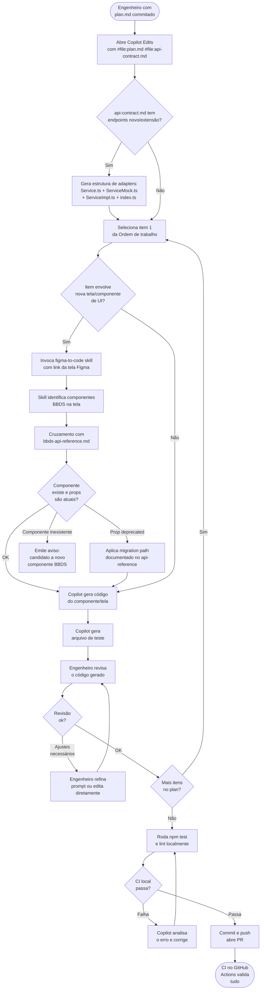

# Agente 04 — Build

**Estágio:** Implementação  
**Runtime:** GitHub Copilot agent mode + Copilot Edits + skills BBDS + figma-to-code skill  
**Responsável pela aprovação:** CI green (gate automático)

> Implementa o `plan.md` aprovado com a API correta do BBDS, validada automaticamente. Novas telas são mapeadas via `figma-to-code` com cruzamento contra a API atual — props incorretas ou obsoletas são detectadas antes do código ser escrito.

---

## O que muda

Hoje, o dev implementa com base no seu conhecimento de quais componentes BBDS existem e quais props usar. Esse conhecimento fica desatualizado a cada release do BBDS. Props deprecated são usadas sem saber, componentes são inventados, e o review humano só captura problemas depois que o código está escrito.

O Agente 04 inverte isso: a API do BBDS está sempre atualizada em `bbds-api-reference.md` (auto-gerado em CI), e o `figma-to-code` skill cruza cada componente do protótipo contra essa referência antes de gerar código. Props deprecated têm migration path documentado — o agente aplica a migração automaticamente.

---

## Pré-requisitos

- **Fase 0b ativa**:
  - `platform-knowledge/bbds-api-reference.md` gerado e atual (versão do BBDS no `package.json`)
  - Skills `bbds-api`, `bbds-ux-guidelines`, `bbds-patterns` publicadas
  - `figma-to-code` skill aprimorada com acesso ao `bbds-api-reference.md`
- `plan.md` commitado no repo (status check `require-plan` passou)
- `api-contract.md` disponível no repo (gerado pelo Agente 02)
- `.github/copilot-instructions.md` do repo com comandos de test/lint documentados

---

## Inputs

### `plan.md` aprovado

O agente usa o plan como roteiro sequencial:

| Seção do plan.md | Como o agente usa |
|---|---|
| `## Arquivos que mudam` | Define o scope exato da implementação — o agente não toca arquivos fora desta lista |
| `## Ordem de trabalho` | Sequência de implementação — cada item é uma sessão de Copilot Edits |
| `## Estratégia de Testes` | O agente gera os arquivos de teste correspondentes a cada item |
| `## Critérios de "Pronto"` | Usado como checklist ao final de cada item |
| `## Notas para o Reviewer` | Contexto de decisões técnicas que o agente documenta nos commits |

### Protótipo Figma (referenciado no `spec.md`)

Para itens de implementação que envolvem novas telas ou componentes, o engenheiro compartilha o link da tela Figma relevante. A `figma-to-code` skill:
1. Lê a estrutura visual da tela (via Figma MCP ou descrição textual)
2. Identifica cada elemento de UI e mapeia para o componente BBDS correspondente
3. Cruza contra `bbds-api-reference.md` — valida que o componente existe e que as props são atuais
4. Emite aviso se um elemento não tem correspondente no BBDS (candidato a novo componente)

### `api-contract.md`

Lido junto com o `plan.md` para gerar a estrutura de adapters. Para cada endpoint classificado como `novo` ou `extensão`, o agente cria:

```
services/<feature>/
  <Feature>Service.ts        ← interface TypeScript (a porta)
  <Feature>ServiceMock.ts    ← mock seguindo o contrato do api-contract.md
  <Feature>ServiceImpl.ts    ← placeholder (implementado quando backend estiver pronto)
  index.ts                   ← seleciona mock ou impl via feature flag
```

As telas importam apenas `<Feature>Service.ts` — nunca o mock ou impl diretamente:

```tsx
// PaymentScreen.tsx
import { usePaymentService } from '@services/payment'
// não sabe e não precisa saber se está usando mock ou implementação real
```

### `.github/copilot-instructions.md` do repo-alvo

Carregado automaticamente. Define:
- Estrutura de pastas (onde criar novos screens, components, services)
- Padrões de nomenclatura (PascalCase para componentes, camelCase para hooks)
- Imports permitidos (allowlist de dependências aprovadas)
- Convenções de teste (jest + testing-library padrão do bundle)
- Comando para rodar os testes localmente

---

## Output — Código implementado + testes

### Checklist de qualidade do output

O output não é um arquivo único — é o conjunto de alterações no repo. Para ser válido:

**Obrigatório:**
- [ ] Todos os arquivos listados em `plan.md > Arquivos que mudam` foram alterados
- [ ] Nenhum arquivo fora do escopo do plan foi alterado (sem "aproveitei e limpei X")
- [ ] Arquivos de teste criados para cada novo módulo (`*.test.tsx` ou `*.spec.ts`)
- [ ] `npm test` passa sem falhas
- [ ] Lint sem erros novos (`eslint --ext .ts,.tsx src/ --max-warnings 0`)
- [ ] Props BBDS usadas existem em `bbds-api-reference.md` (versão atual)
- [ ] Nenhuma prop `@deprecated` usada sem migration path aplicado
- [ ] Para cada endpoint `novo` ou `extensão` em `api-contract.md`: estrutura de adapter completa criada (`<Feature>Service.ts`, `<Feature>ServiceMock.ts`, `<Feature>ServiceImpl.ts`, `index.ts`)
- [ ] Nenhuma tela importa `ServiceMock` ou `ServiceImpl` diretamente — apenas via interface ou hook
- [ ] Feature flag para cada novo endpoint criada e configurada como `false` (mock ativo por padrão)

**Proibido:**
- [ ] `console.log`, `console.error`, `debugger` no diff
- [ ] Imports de bibliotecas fora da allowlist do `copilot-instructions.md`
- [ ] Alterações em arquivos de teste durante uma run de fix (enforçado por instrução no `copilot-instructions.md`)
- [ ] Hard-coded strings de UI (devem usar i18n ou constantes)

---

## Fluxo



---

## Evals

### Por que evals para este agente

Mudanças na skill `bbds-api` (novo release do BBDS), em `copilot-instructions.md` (novas convenções), ou no template de testes podem alterar o comportamento do Build Agent sem que ninguém perceba até o code review humano. Com evals, essas regressões são detectadas em CI antes do merge das mudanças de configuração.

### Estrutura de uma task de eval

```
agents/04-build/evals/tasks/
└── task-001-tela-confirmacao/
    ├── input/
    │   ├── plan.md                      # plan aprovado para esta feature
    │   ├── spec.md                      # spec (contexto adicional)
    │   ├── repo_snapshot/               # estado atual dos arquivos do repo
    │   │   ├── src/navigation/AppNavigator.tsx
    │   │   └── src/services/creditApi.ts
    │   └── figma_context.md             # descrição da tela Figma (simulada)
    └── expected/
        ├── src/screens/ConfirmacaoDadosScreen.tsx   # arquivo esperado
        ├── src/screens/ConfirmacaoDadosScreen.test.tsx
        └── src/navigation/AppNavigator.tsx          # arquivo modificado esperado
```

### Tipos de graders

#### Code-based (prioritários — sem custo de modelo)

```python
# graders/build_validation.py
import re, subprocess, ast

def grade(output_files: dict, plan_md: str, api_reference: str) -> dict:
    results = {}

    # 1. Testes passam?
    test_result = subprocess.run(['npm', 'test', '--ci'], capture_output=True, text=True)
    results['tests_pass'] = test_result.returncode == 0
    results['test_output'] = test_result.stdout[-2000:]  # últimas 2000 chars

    # 2. Lint passa?
    lint_result = subprocess.run(
        ['npx', 'eslint', '--ext', '.ts,.tsx', 'src/', '--max-warnings', '0'],
        capture_output=True, text=True
    )
    results['lint_pass'] = lint_result.returncode == 0

    # 3. Debug code presente?
    all_code = '\n'.join(output_files.values())
    debug_patterns = [r'console\.(log|error|warn)', r'debugger;', r'TODO:', r'FIXME:']
    results['debug_code'] = [p for p in debug_patterns if re.search(p, all_code)]

    # 4. Props BBDS válidas?
    component_usages = re.findall(r'<(\w+)\s+([^>]+)', all_code)
    invalid_props = []
    for component, props_str in component_usages:
        if component in api_reference:
            props_used = re.findall(r'(\w+)=', props_str)
            valid_props = re.findall(rf'{component}.*?props:(.*?)(?=\n##)', api_reference, re.DOTALL)
            for prop in props_used:
                if valid_props and prop not in valid_props[0]:
                    invalid_props.append(f"{component}.{prop}")
    results['invalid_bbds_props'] = invalid_props

    # 5. Props deprecated sem migration?
    deprecated_used = re.findall(r'@deprecated.*?(\w+)', api_reference)
    results['deprecated_props_used'] = [p for p in deprecated_used if p in all_code]

    # 6. Imports não-aprovados?
    imports = re.findall(r"from '([^']+)'", all_code)
    # allowlist vem do copilot-instructions.md
    approved_libs = ['react', 'react-native', '@company/bbds', 'react-navigation']
    results['unapproved_imports'] = [i for i in imports
                                     if not any(i.startswith(lib) for lib in approved_libs)
                                     and not i.startswith('.')]

    # 7. Adapter pattern: verificar estrutura para endpoints 'novo'/'extensão'
    import os
    adapter_errors = []
    # api_contract_endpoints: lista de {name, classification} passada como parâmetro
    for ep in api_contract_endpoints:
        if ep['classification'] in ('novo', 'extensão'):
            feature = ep['feature']
            required_files = [
                f"services/{feature}/{feature.capitalize()}Service.ts",
                f"services/{feature}/{feature.capitalize()}ServiceMock.ts",
                f"services/{feature}/{feature.capitalize()}ServiceImpl.ts",
                f"services/{feature}/index.ts",
            ]
            for f in required_files:
                if f not in output_files:
                    adapter_errors.append(f"arquivo de adapter faltando: {f}")

    # 8. Telas não importam mock/impl diretamente
    direct_imports = re.findall(r"from '[^']*ServiceMock|from '[^']*ServiceImpl", all_code)
    # excluir os próprios arquivos de adapter
    direct_imports_from_screens = [i for i in direct_imports
                                   if not any(f in i for f in ['ServiceMock', 'ServiceImpl']
                                              if i.endswith(('.ts', '.tsx')))]

    results['adapter_pattern_errors'] = adapter_errors
    results['direct_mock_imports'] = direct_imports
    results['passed'] = (
        results['tests_pass'] and
        results['lint_pass'] and
        not results['debug_code'] and
        not results['invalid_bbds_props'] and
        not results['deprecated_props_used'] and
        not results['unapproved_imports'] and
        not adapter_errors
    )
    return results
```

#### Model-based

```
Avalie o código gerado em relação ao plan.md e ao spec.md.

plan.md: {plan_content}
spec.md: {spec_content}
Código gerado (diff): {code_diff}

Critérios (1-5):

1. FIDELIDADE AO PLAN (1-5)
   O código implementa exatamente o que o plan.md descreve?
   1 = itens do plan ignorados ou implementados incorretamente | 5 = implementação fiel

2. QUALIDADE DOS TESTES (1-5)
   Os testes cobrem os cenários críticos dos critérios de aceitação?
   1 = testes triviais ou ausentes | 5 = cenários de sucesso e falha cobertos

3. ADERÊNCIA AOS PADRÕES BBDS (1-5)
   Os novos componentes seguem bbds-patterns (composição, hierarquia)?
   1 = componentes usados fora do padrão | 5 = alinhados com os padrões

4. LEGIBILIDADE E MANUTENIBILIDADE (1-5)
   O código é legível para um engenheiro que não participou do planejamento?
   1 = lógica obscura, nomes ruins | 5 = autoexplicativo
```

### Como rodar

```bash
npm run eval -- --agent=04-build
```

**Nota importante:** As tasks de build eval precisam de um ambiente com as dependências instaladas para rodar `npm test`. O CI usa um container com as dependências do bundle-alvo pré-instaladas.

CI dispara em mudanças em: `.github/skills/bbds-api/`, `platform-knowledge/bbds-api-reference.md`, `agents/04-build/`, `.github/copilot-instructions.md` de repos incluídos.

### Criando tasks do zero

Para cada novo padrão de implementação que o time quer garantir (ex: "toda tela deve ter loading state"), criar uma task com:
1. Um plan.md que pede a implementação de uma tela simples
2. Um expected output que inclui o loading state implementado corretamente
3. O grader verifica que o loading state está presente e correto

---

## Governança

### Gate: CI green

O gate principal do Build Agent não é humano — é o CI. A implementação avança quando:
- Todos os testes passam (`npm test --ci`)
- Lint sem erros novos
- Evals do agente passam (via `eval-suite.yml` se mudanças em config)
- Status check `require-plan` confirma que `plan.md` está presente

### Restrição crítica: proibido editar testes durante fix

O Build Agent não pode alterar arquivos de teste (`*.test.tsx`, `*.spec.ts`) durante uma run de correção de falha. Isso previne que o agente "passe no teste" removendo ou enfraquecendo a validação.

**Como é enforçado:**
1. Instrução explícita no `copilot-instructions.md`:
   ```
   NUNCA altere arquivos de teste para fazer um teste passar.
   Se um teste está falhando, corrija o código de produção.
   Arquivos *.test.tsx e *.spec.ts são read-only durante correções.
   ```
2. Status check no CI que detecta alterações em arquivos de teste em commits marcados como "fix":
   ```yaml
   - name: Check test files not modified in fix commits
     if: contains(github.event.head_commit.message, 'fix:')
     run: |
       git diff --name-only HEAD~1 HEAD | grep -E '\.(test|spec)\.(ts|tsx)$' && \
         echo "❌ Test files modified in fix commit" && exit 1 || exit 0
   ```

### Separação de funções

O Copilot não commita diretamente — o engenheiro faz o commit e o push. O engenheiro é responsável por revisar o código antes de commitar (não commitar "no escuro").

---

## Medição

### Métricas Leading

#### Taxa de CI first-pass em mudanças geradas com o agente

- **Por que foi escolhida**: Se o primeiro push já passa no CI, o agente está gerando código correto. Se falha frequentemente, o agente está gerando código que o engenheiro não revisa adequadamente antes de pushar — ou o agente tem problemas com o contexto do repo.
- **O que indica quando cai**: Agente gerando código com erros que passam pelo review do engenheiro. Investigar: problemas de BBDS props? Testes faltando? Imports incorretos?
- **Como medir**: Proporção de PRs onde o primeiro CI run (sem re-runs) passou / total de PRs
  ```bash
  # Via GitHub API — workflows que passaram na primeira tentativa
  gh run list --limit 100 --json status,attempt,headBranch \
    | jq '[.[] | select(.attempt == 1 and .status == "completed")] | length'
  ```
- **Frequência**: Semanal
- **Target**: > 80% | Alarme: < 60% consistentemente

#### Proporção de props BBDS deprecated detectadas pelos graders vs. chegando ao code review

- **Por que foi escolhida**: Mede a eficácia dos graders code-based em capturar problemas de BBDS antes do review humano. Se mais problemas chegam ao review do que o eval captura, os graders precisam de ajuste.
- **Como medir**: Comparar "deprecated props sinalizadas em PR review" com "deprecated props detectadas pelos evals no mesmo período"
- **Target**: > 90% capturadas pelos graders | Alarme: < 70%

### Métricas Lagging

#### Ciclos de rework por PR vs. média histórica

- **Por que foi escolhida**: Um PR com muitos ciclos de review (comentário → correção → novo review) indica que o código gerado tem problemas que o CI não capturou. Comparar com a média histórica (antes do agente) mostra se a esteira está ajudando ou criando mais rework.
- **Como medir**:
  ```bash
  # Número médio de review cycles por PR (comentário + novo push)
  gh pr view [PR_NUMBER] --json reviews,commits \
    | jq '{reviews: .reviews | length, commits: .commits | length}'
  ```
  Agregar mensalmente: média de review cycles antes do agente vs. após.
- **Frequência**: Mensal (comparação trimestral)
- **Target**: ≤ média histórica | Alarme: > 1.5x a média histórica

#### Taxa de bugs de BBDS (props incorretas, componentes errados) encontrados em produção

- **Por que foi escolhida**: Validação final da cadeia bbds-api → skill → Build Agent → Review. Se problemas de BBDS chegam a produção, significa que o grader, o agente, E o review humano falharam — indica ponto cego sistemático.
- **Como medir**: Issues de produção tagueadas com `bbds-bug` / total de issues de produção no período
- **Frequência**: Trimestral
- **Target**: < 2% das issues de produção | Alarme: > 5%
