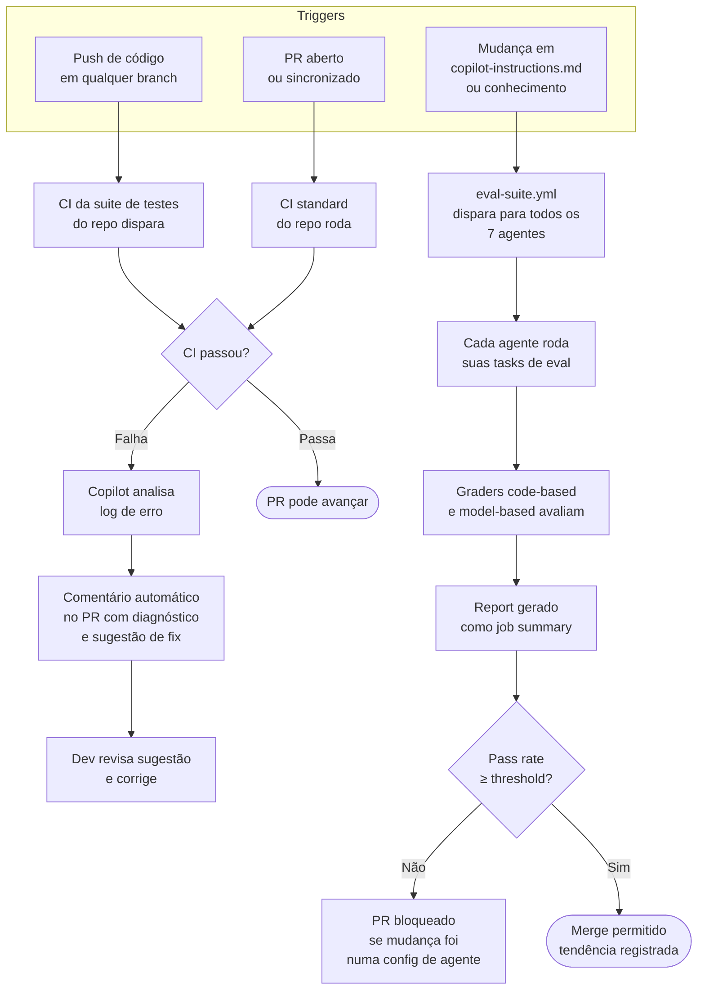

# Agente 05 — Test

**Estágio:** Teste  
**Runtime:** GitHub Actions + Copilot API (non-interactive)  
**Responsável pela aprovação:** Threshold de CI configurado pelo tech lead

> Testa a configuração dos agentes como código. Regressões em `copilot-instructions.md` ou no contexto de conhecimento injetado são detectadas antes de chegarem ao desenvolvedor. Incidentes de produção tornam-se evals permanentes.

---

## Quando os evals rodam

Os evals **não são um passo da esteira de feature** — são um CI gate separado, acionado por mudanças na configuração dos agentes.

**Trigger:** o workflow `eval-suite.yml` dispara automaticamente quando um PR altera qualquer um destes caminhos:

```
.github/copilot-instructions.md     # instrução principal do Copilot
agents/*/evals/**                   # tasks e graders de qualquer agente
platform-knowledge/**               # conteúdo de domínio injetado via MCP
```

**Cobertura:** a eval suite cobre todos os agentes ativos (02–07). O Agente 05 é responsável pela infraestrutura, mas não é o único avaliado — cada agente tem suas próprias tasks em `agents/*/evals/tasks/`.

**O que NÃO dispara evals:** PRs de feature (código novo, bugfixes, refactoring). Um PR que altera `src/services/creditApi.ts` passa pela suite de testes padrão do repo — não pela eval suite dos agentes.

---

## O que muda

Agentes de IA são configurados via prompt — e configurações mudam. Sem testes, uma mudança em `copilot-instructions.md` ou no conteúdo de um domínio de conhecimento pode quebrar o comportamento de um agente existente sem que ninguém perceba.

O Agente 05 implementa o conceito de "testes para configuração de agentes": a eval suite roda em CI da mesma forma que testes unitários rodam — automaticamente, com pass/fail determinístico, bloqueando merge quando o threshold não é atingido.

Adicionalmente, quando um PR tem falhas de CI, o Copilot analisa o erro e sugere a correção diretamente no PR — reduzindo o tempo que o dev passa debugando logs.

---

## Pré-requisitos

- `eval-suite.yml` configurado no `.github/workflows/`
- Tasks de eval disponíveis em `agents/*/evals/tasks/` para todos os agentes ativos
- Threshold de pass rate definido e aprovado pelo tech lead (recomendado: 85% global)
- Copilot API acessível em modo non-interactive nos GitHub Actions runners

---

## Inputs

### Code diff + resultados de CI

Para a funcionalidade de análise de falha de CI (comentário no PR):

| Input | Fonte | Conteúdo |
|---|---|---|
| Código do PR | `git diff origin/main...HEAD` | Arquivos alterados e conteúdo |
| Log de CI | `gh run view --log` | Output completo do run que falhou |
| Histórico de evals | GitHub Actions artifacts | Pass rates anteriores para comparação de tendência |
| Contexto do repo | `.github/copilot-instructions.md` | Para entender o ambiente onde o erro ocorreu |

### Tasks de eval (para a eval suite)

Para a funcionalidade de avaliação dos agentes:

```
agents/
├── 02-spec/evals/tasks/          # tasks do Spec Agent
├── 03-plan/evals/tasks/          # tasks do Plan Agent
├── 04-build/evals/tasks/         # tasks do Build Agent
├── 05-test/evals/tasks/          # tasks do Test Agent (meta-eval)
├── 06-deploy/evals/tasks/        # tasks do Deploy Agent
└── 07-maintain/evals/tasks/      # tasks do Maintain Agent
```

---

## Output

### Análise de falha de CI (comentário no PR)

Formato do comentário automático no PR quando CI falha:

```markdown
## Análise de Falha de CI — Copilot

**Falha identificada:** `TypeError: Cannot read property 'validate' of undefined`
**Arquivo:** `src/services/creditApi.ts:47`
**Contexto:** O mock do endpoint no teste está retornando `null` mas o código
espera um objeto com método `validate`.

**Causa provável:** O mock em `creditApi.test.ts:23` precisa retornar
`{ validate: jest.fn() }` em vez de `null`.

**Sugestão de fix:**
```ts
// creditApi.test.ts:23 — altere:
jest.mock('../creditApi', () => null);
// para:
jest.mock('../creditApi', () => ({ validate: jest.fn().mockResolvedValue({}) }));
```

Confiança: **Alta** — padrão de erro de mock bem conhecido.
```

### Relatório da eval suite

Gerado como GitHub Actions job summary após cada run do `eval-suite.yml`:

```markdown
## Eval Suite Results — 2024-01-15

| Agente | Tasks | Passed | Failed | Pass Rate | Trend |
|---|---|---|---|---|---|
| 01 Intent | 23 | 21 | 2 | 91.3% | ↑ +2.1% |
| 02 Spec | 31 | 28 | 3 | 90.3% | → 0% |
| 03 Plan | 18 | 14 | 4 | 77.8% | ↓ -5.2% ⚠️ |
| 04 Build | 25 | 23 | 2 | 92.0% | ↑ +1.0% |
| 05 Test | 12 | 11 | 1 | 91.7% | → 0% |
| 06 Deploy | 20 | 19 | 1 | 95.0% | ↑ +3.0% |
| 07 Maintain | 28 | 22 | 6 | 78.6% | ↓ -8.3% ⚠️ |

**Global pass rate: 87.1%** ✅ (threshold: 85%)

### Falhas detectadas:
- **03 Plan** ⚠️: Task `task-012-multi-bundle` — plano listando arquivos inexistentes
- **07 Maintain** ⚠️: Tasks de correlação de jornada — hipótese incorreta em 4/6 casos

### Ação recomendada:
- Agente 03: revisar como o Plan Agent lida com specs que afetam múltiplos bundles
- Agente 07: calibrar a árvore de diagnóstico para casos sem correlação de endpoint
```

---

## Fluxo



---

## Evals

### O meta-eval: testando o Test Agent

O Agente 05 tem sua própria suite de evals — testando se ele diagnostica corretamente as falhas de CI.

### Estrutura de uma task de eval do Agente 05

```
agents/05-test/evals/tasks/
└── task-001-mock-error/
    ├── input/
    │   ├── ci_log.txt              # log completo do CI que falhou
    │   ├── failing_test.tsx        # arquivo de teste que falhou
    │   └── source_file.tsx         # arquivo de código sendo testado
    └── expected/
        ├── diagnosis.md            # diagnóstico esperado
        └── suggested_fix.patch     # fix esperado em formato diff
```

### Tipos de graders do meta-eval

#### Code-based

```python
# graders/test_agent_validation.py
import subprocess, difflib

def grade(diagnosis_md: str, suggested_fix: str,
          expected_diagnosis: str, expected_fix: str) -> dict:

    # O diagnóstico identifica o arquivo e linha corretos?
    import re
    expected_file = re.search(r'`([^`]+\.tsx?):\d+`', expected_diagnosis)
    actual_file = re.search(r'`([^`]+\.tsx?):\d+`', diagnosis_md)
    file_correct = expected_file and actual_file and expected_file.group(1) == actual_file.group(1)

    # O fix sugerido resolve o problema?
    # Aplicar o patch e rodar o teste
    with open('/tmp/test_fix.patch', 'w') as f:
        f.write(suggested_fix)
    apply_result = subprocess.run(['patch', '-p1', '-i', '/tmp/test_fix.patch'],
                                  capture_output=True)
    if apply_result.returncode == 0:
        test_result = subprocess.run(['npm', 'test', '--ci', '--bail'],
                                     capture_output=True)
        fix_works = test_result.returncode == 0
    else:
        fix_works = False

    # Falso positivo? (agente reportou erro quando não há erro)
    false_positive = 'falha' in diagnosis_md.lower() and 'não há falha' in expected_diagnosis.lower()

    return {
        "passed": file_correct and fix_works and not false_positive,
        "correct_file_identified": file_correct,
        "fix_resolves_problem": fix_works,
        "false_positive": false_positive
    }
```

#### Model-based

```
Avalie o diagnóstico de falha de CI abaixo.

Log de CI: {ci_log}
Diagnóstico gerado: {diagnosis}
Fix sugerido: {fix}
Ground truth (diagnóstico correto): {expected_diagnosis}

Critérios (1-5):

1. PRECISÃO DO DIAGNÓSTICO (1-5)
   O diagnóstico identifica a causa raiz real da falha?
   1 = causa errada ou vaga | 5 = causa exata e fundamentada

2. ACIONABILIDADE DO FIX (1-5)
   O dev consegue aplicar o fix sem ambiguidade?
   1 = fix vago ou incorreto | 5 = fix claro, específico e correto

3. AUSÊNCIA DE FALSOS POSITIVOS (pass/fail)
   O agente reportou uma falha quando o CI passou?
   pass = não reportou / fail = reportou falso positivo
```

### Como rodar a eval suite completa

```bash
# Todos os agentes
npm run eval

# Agente específico
npm run eval -- --agent=05-test

# Com output detalhado
npm run eval -- --verbose --agent=05-test
```

### Como adicionar tasks de regressão de CI

Quando um falha de CI não foi corretamente diagnosticada pelo agente:
1. Capturar o log da run: `gh run view [RUN_ID] --log > ci_log.txt`
2. Criar `agents/05-test/evals/tasks/task-NNN-descricao/input/ci_log.txt`
3. Documentar o diagnóstico correto em `expected/diagnosis.md`
4. Criar o patch correto em `expected/suggested_fix.patch`
5. Confirmar que o grader detecta o problema no output atual
6. Corrigir e validar

---

## Governança

### Quem define o threshold de pass rate

O **tech lead** define e aprova o threshold (default: 85% global, mas pode variar por agente). Mudanças no threshold em `eval-suite.yml` requerem PR aprovado pelo tech lead — não pode ser alterado unilateralmente.

**Por que o tech lead e não automático:** O threshold é uma política de qualidade. Reduzir o threshold para "fazer a CI passar" seria equivalente a deletar testes — requer decisão consciente de um humano com autoridade técnica.

### Regra de bloqueio

O `eval-suite.yml` bloqueia o merge de PRs que alterem:
- `.github/copilot-instructions.md`
- `platform-knowledge/**`
- `templates/*.md`
- `agents/*/evals/`

Se o pass rate cair abaixo do threshold após essa mudança, o PR é bloqueado até que:
1. A mudança seja revertida, ou
2. As tasks falhando sejam corrigidas (ajuste no prompt/skill), ou
3. O tech lead explicitamente aceita o risco e aprova com override

### "Incidentes de produção viram evals permanentes"

Esta é a regra mais importante da governança do Agente 05. Quando um bug chega a produção:
1. O post-mortem identifica em qual stage o problema deveria ter sido capturado
2. Uma task de eval é criada para o agente correspondente
3. A task fica na suite permanentemente
4. A meta é que o incidente jamais passe novamente

---

## Medição

### Métricas Leading

#### Eval pass rate por agente (trend semanal)

- **Por que foi escolhida**: A métrica mais direta de saúde dos agentes. Uma queda no pass rate de um agente específico antecipa problemas antes que cheguem ao code review ou a produção. É o "teste verde" dos agentes.
- **O que indica quando cai**: Uma mudança recente em skills ou `copilot-instructions.md` introduziu regressão. Olhar para o commit que causou a queda.
- **Como medir**: Automático — o `eval-suite.yml` gera o relatório. Para acompanhar tendência:
  ```bash
  # Histórico de pass rates via GitHub Actions API
  gh run list --workflow=eval-suite.yml --json conclusion,createdAt \
    | jq '[.[] | {date: .createdAt[:10], passed: (.conclusion == "success")}]'
  ```
- **Frequência**: Cada run do CI (automático); dashboard semanal
- **Target**: ≥ 85% global, ≥ 80% por agente individual | Alarme: qualquer agente < 70%

#### Tempo médio de diagnóstico de falha de CI (quando o agente comenta no PR)

- **Por que foi escolhida**: O agente deve comentar a análise em minutos, não horas. Se demorar, o dev já terá resolvido por conta própria — o agente se torna inútil nessa função.
- **Como medir**: Timestamp do PR open/fail → timestamp do comentário do Copilot
- **Target**: < 5 minutos | Alarme: > 15 minutos

### Métricas Lagging

#### Regressões capturadas em CI vs. chegadas em produção

- **Por que foi escolhida**: A métrica definitiva de eficácia da eval suite. Se bugs que deveriam ser capturados em CI chegam a produção, os evals não estão cobrindo os casos certos.
- **O que indica quando cai**: Evals com coverage insuficiente para cenários que existem em produção. Ação: criar tasks de eval baseadas nos incidentes.
- **Como medir**:
  ```
  Taxa de captura = Bugs detectados em CI / (Bugs detectados em CI + Bugs detectados em produção)
  ```
  Fonte: Issues de produção + PR comments com labels de bug
- **Frequência**: Trimestral
- **Target**: > 90% capturados em CI | Alarme: < 75%

#### Cobertura de casos de uso pelos evals

- **Por que foi escolhida**: O número absoluto de tasks não importa — o que importa é se elas cobrem os fluxos reais que o agente executa. Tasks que não representam casos de uso reais são ruído.
- **Como medir**: Revisão trimestral com o tech lead — comparar as tasks existentes com os PRs mergeados no trimestre e identificar padrões não cobertos
- **Target**: Sem categoria de PR recorrente sem cobertura de eval | Revisão: trimestral
