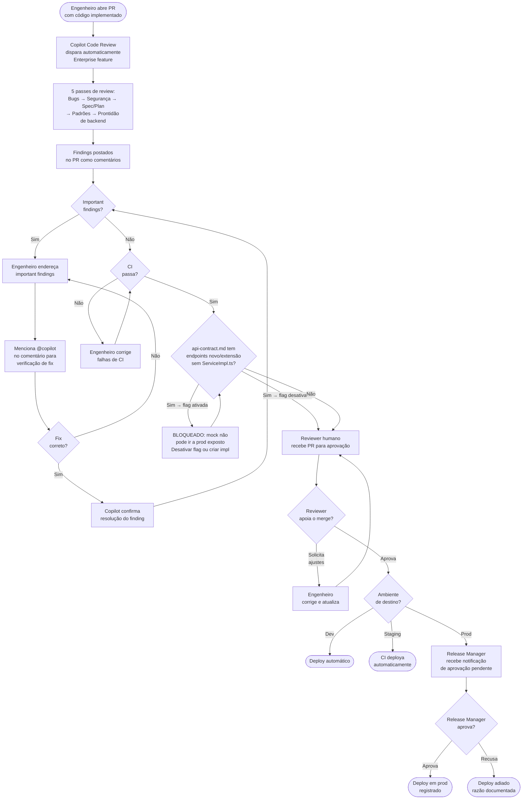

# Agente 06 — Deploy

**Estágio:** Deploy  
**Runtime:** Copilot Code Review (Enterprise) + GitHub Actions  
**Responsável pela aprovação:** 1 humano + CI green (Staging automático; Prod: release manager)

> Revisa PRs automaticamente usando `REVIEW.md` como rubrica e `spec.md` como especificação de referência. O humano aprova a decisão — o Copilot executa a revisão.

---

## O que muda

Hoje, o code review depende inteiramente do conhecimento e disponibilidade do revisor. Um revisor novo no bundle pode não conhecer todos os padrões. Um revisor sobrecarregado pode não ter tempo para uma revisão completa. E ninguém verifica sistematicamente se o código implementado está alinhado com a spec aprovada.

O Copilot Code Review faz a revisão sistemática — verifica bugs, segurança, compliance com o spec.md e padrões de plataforma — em menos de 15 minutos. O humano revisa os findings e toma a decisão de aprovar ou pedir ajustes. O humano não é substituído; seu tempo é usado onde importa.

---

## Pré-requisitos

- Copilot Code Review habilitado no GitHub Copilot Enterprise (feature Enterprise)
- `REVIEW.md` commitado no repo com as rubricas de review
- `spec.md`, `plan.md` e `api-contract.md` presentes na branch ou referenciados no PR
- Branch protection configurado: 1 aprovação humana + CI green = obrigatórios
- GitHub environment `production` configurado com aprovador nomeado

---

## Inputs

### PR diff

O que o Copilot Code Review analisa:

| Componente do PR | Como é usado no review |
|---|---|
| Código alterado | Análise linha por linha de bugs, segurança, logic errors |
| Arquivos de teste | Verificação de cobertura dos critérios de aceitação do spec.md |
| `plan.md` (referenciado) | Verificação de conformidade — o código implementa o que o plan disse? |
| `spec.md` (referenciado) | Verificação de conformidade com os requisitos aprovados |
| `api-contract.md` (referenciado) | Verificação de prontidão de backend — gate de feature flag |
| `.github/copilot-instructions.md` | Padrões de plataforma para validação |

### `REVIEW.md` — a rubrica de review

Define o que o Copilot revisa e como prioriza. Cada repo tem seu `REVIEW.md` (baseado no template, customizado para o bundle):

```markdown
# REVIEW.md — [Nome do Bundle]

## Passes de Review

### Pass 1: Bugs e erros de lógica (Severidade: Important)
- Condições de null pointer não tratadas
- Lógica de negócio que diverge dos critérios de aceitação do spec.md
- Race conditions em código assíncrono
- Boundary conditions não cobertas (int overflow, empty array, etc.)

### Pass 2: Segurança (Severidade: Important)
- Dados sensíveis em logs, AsyncStorage não criptografado, ou estado Redux
- Inputs não sanitizados de fontes externas
- Tokens ou credenciais hard-coded
- Requisições HTTP sem tratamento de erro de autenticação

### Pass 3: Conformidade com spec.md e plan.md (Severidade: Important)
- Código que implementa algo diferente do que o spec.md aprovado especifica
- Arquivos modificados que não estão no plan.md
- Critérios de aceitação do spec.md não cobertos por testes

### Pass 4: Padrões de plataforma React Native (Severidade: Nit se cosmético)
- Naming conventions (PascalCase components, camelCase hooks)
- Estrutura de pastas fora do padrão do bundle
- Uso de bibliotecas fora da allowlist aprovada
- Props BBDS incorretas ou deprecated

### Pass 5: Prontidão de backend (Severidade: Important — bloqueia deploy em prod)

Para cada endpoint em `api-contract.md` classificado como `novo` ou `extensão`:

1. Existe `<Feature>ServiceImpl.ts` no repo?
   - **SIM** → deploy usa implementação real, feature pode ser ativada
   - **NÃO** → verificar se a feature flag está desativada

2. Existe `<Feature>ServiceMock.ts` ativo via feature flag desativada?
   - **Flag desativada + ServiceMock ativo** → deploy autorizado (feature oculta de usuários)
   - **Flag ativada sem ServiceImpl** → **deploy BLOQUEADO** — mock não pode chegar a produção exposto

3. Estrutura do adapter está correta?
   - Telas importam apenas a interface (`<Feature>Service.ts`)?
   - `index.ts` usa feature flag para selecionar mock ou impl?

## Exclusões (não reportar)
- Arquivos gerados automaticamente (*.generated.ts, *.d.ts)
- __mocks__ e fixtures
- Regras já enforçadas pelo lint (não duplicar)
- Mudanças de formatação puras

## Limites
- Máximo: 10 comentários de Nit por PR (priorizar os mais impactantes)
- Important findings: sem limite — todos devem ser reportados
- Agrupamento: findings similares em múltiplos arquivos devem ser agrupados em 1 comentário
```

---

## Output

### Comentários de review inline

O Copilot Code Review gera comentários diretamente no diff do PR, no formato:

```
[Important] Dado nulo não tratado — `user.profile` pode ser null quando o
usuário não completou o onboarding. A linha 47 vai lançar TypeError.

Sugestão: Adicionar optional chaining ou verificação explícita:
  if (!user.profile) return <EmptyState />;
```

```
[Nit] Naming convention — hooks devem começar com `use`. Renomear
`fetchUserData` para `useFetchUserData` conforme platform-standards.
```

### Sumário de review

Comentário geral no PR com o resultado do review:

```markdown
## Copilot Code Review — Sumário

**Encontrados:** 2 Important, 3 Nits
**Conformidade com spec.md:** ✅ RF-01, RF-02 implementados | ⚠️ RF-03 sem teste
**Conformidade com plan.md:** ✅ todos os arquivos planejados presentes

### Itens que requerem atenção antes do merge:
1. [Important] Null pointer em `ProfileScreen.tsx:47`
2. [Important] RF-03 não tem teste automatizado — critério de aceitação não verificável
3. [Important] Dado sensível (CPF) em log na linha 82 de `userApi.ts`

Os 3 nits são opcionais — merge pode ocorrer sem endereçá-los.
```

---

## Fluxo



---

## Evals

### Por que evals para este agente

O Copilot Code Review usa o `REVIEW.md` como rubrica. Se o `REVIEW.md` mudar (novo pass adicionado, exclusões atualizadas), o comportamento do review muda. Evals garantem que: (1) bugs conhecidos são sempre detectados, (2) falsos positivos (findings inválidos) não ultrapassam o limite aceitável.

### Estrutura de uma task de eval

```
agents/06-deploy/evals/tasks/
└── task-001-null-pointer-bug/
    ├── input/
    │   ├── pr_diff.patch           # diff do PR para review
    │   ├── spec.md                 # spec de referência
    │   ├── plan.md                 # plan de referência
    │   └── REVIEW.md               # rubrica usada
    └── expected/
        ├── findings.json           # findings esperados (com severidades)
        └── false_positives.json    # findings que NÃO devem aparecer
```

**`findings.json`** — ground truth do review:
```json
{
  "must_find": [
    {
      "file": "src/screens/ProfileScreen.tsx",
      "line_range": [44, 50],
      "severity": "Important",
      "category": "null_pointer",
      "description_contains": ["null", "profile", "TypeError"]
    },
    {
      "file": "src/services/userApi.ts",
      "line_range": [80, 85],
      "severity": "Important",
      "category": "security",
      "description_contains": ["CPF", "log", "sensível"]
    }
  ],
  "false_positives_budget": 1
}
```

**`false_positives.json`** — findings que indicariam review incorreto:
```json
{
  "must_not_find": [
    "Comentários sobre formatação já cobertos pelo lint",
    "Findings em arquivos *.generated.ts"
  ]
}
```

### Tipos de graders

#### Code-based

```python
# graders/review_validation.py
import json, re

def grade(review_output: str, findings_spec: dict) -> dict:
    results = {}

    # Todos os bugs esperados foram encontrados?
    findings_found = []
    for expected in findings_spec['must_find']:
        file_mentioned = expected['file'] in review_output
        line_mentioned = any(
            str(l) in review_output for l in range(*expected['line_range'])
        )
        keywords_present = all(
            kw.lower() in review_output.lower()
            for kw in expected['description_contains']
        )
        found = file_mentioned and (line_mentioned or keywords_present)
        findings_found.append({
            "expected": expected,
            "found": found
        })

    # Falsos positivos (findings em arquivos excluídos)
    false_positive_patterns = [
        r'\.generated\.ts',
        r'__mocks__',
        r'\.d\.ts'
    ]
    false_positives = sum(
        1 for pattern in false_positive_patterns
        if re.search(pattern, review_output)
    )

    # Nits dentro do limite?
    nit_count = review_output.lower().count('[nit]')

    # Severidades corretas?
    important_in_output = review_output.lower().count('[important]')
    expected_important = len([f for f in findings_spec['must_find']
                              if f['severity'] == 'Important'])

    missed = [f for f in findings_found if not f['found']]
    budget = findings_spec.get('false_positives_budget', 1)

    results['passed'] = (
        not missed and
        false_positives <= budget and
        nit_count <= 10
    )
    results['missed_findings'] = [f['expected'] for f in missed]
    results['false_positives'] = false_positives
    results['nit_count'] = nit_count
    results['precision'] = important_in_output / max(expected_important, 1)
    results['recall'] = len(findings_found) - len(missed) / max(len(findings_found), 1)
    return results
```

#### Model-based

```
Avalie o review gerado pelo Copilot Code Review.

Código revisado (diff): {diff}
Review gerado: {review_output}
Bugs esperados (ground truth): {expected_findings}

Critérios (1-5):

1. QUALIDADE DA EVIDÊNCIA (1-5)
   Cada finding tem evidência clara (arquivo, linha, explicação)?
   1 = findings vagos sem localização | 5 = todos com evidência específica

2. QUALIDADE DAS SUGESTÕES DE FIX (1-5)
   As sugestões de correção são corretas e aplicáveis?
   1 = fixes incorretos ou ausentes | 5 = todos corretos e diretamente aplicáveis

3. PRIORIZAÇÃO (1-5)
   Important e Nit usados corretamente? Nits não inflam a lista?
   1 = importantes como nit, nits como importantes | 5 = priorização correta
```

---

## Governança

### Tiering de autonomia por ambiente

A autonomia do agente escala inversamente ao risco do ambiente:

| Ambiente | Quem autoriza | Mecanismo |
|---|---|---|
| **Dev** | CI green | Deploy automático após CI pass |
| **Staging** | CI green + 1 humano | PR merge → deploy automático |
| **Produção** | CI + 1 humano + Release Manager | GitHub environment protection com aprovador nomeado |

### Separação de funções crítica

**O agente não aprova o próprio código.** O Copilot Code Review revisa o PR, mas:
- Não tem permissão de fazer merge
- Não conta como o reviewer humano obrigatório
- O reviewer humano deve ser alguém diferente do autor do PR (branch protection)

Isso é enforçado por: branch protection rule no GitHub que exige 1 review de alguém diferente do committer.

### O que o reviewer humano está verificando

O Copilot faz a revisão técnica sistemática. O humano faz o julgamento:
1. **Os findings importantes foram corretamente endereçados?** — Revisar as conversas de fixing
2. **Há contexto de negócio que o Copilot não tem?** — Mudanças que parecem corretas tecnicamente mas estão erradas estrategicamente
3. **O PR está dentro do scope do plan.md?** — O Copilot sinaliza desvios, o humano julga se são aceitáveis
4. **O timing está correto?** — Há razão para não mergear agora (freeze, dependência, etc.)?

### Gate de produção: release manager

O deploy em produção requer aprovação explícita do release manager via GitHub environment protection:
```yaml
# .github/environments/production (configurado no GitHub UI)
# Reviewers: [release-manager-team]
# Deployment branches: main
# Wait timer: 0 min (aprovação imediata quando solicitada)
```

O release manager recebe notificação no GitHub, tem acesso ao link do PR, ao Copilot Review summary, e ao histórico de CI. Aprova ou recusa com comentário.

### Gate de backend: prontidão de serviços

Deploy de features com endpoints `novo` ou `extensão` segue esta regra:

| Estado | Deploy permitido? | Comportamento em produção |
|---|---|---|
| `ServiceImpl.ts` existe + flag ativada | Sim | Feature visível, usando backend real |
| `ServiceImpl.ts` não existe + flag desativada | Sim | Feature oculta, mock ativo internamente |
| `ServiceImpl.ts` não existe + flag ativada | **Não** | Mock exposto a usuários — bloqueado |

A ativação da feature flag é gate explicitamente humano — feita pelo release manager após validação do backend real em staging. O release manager não deve ativar a flag enquanto o time de backend não confirmar que o serviço está pronto.

### Achados que alimentam `copilot-instructions.md`

Quando o Copilot Code Review encontra um padrão de problema recorrente (ex: 3 PRs em 2 semanas com null pointer no mesmo pattern), o tech lead pode decidir adicionar ao `copilot-instructions.md` como anti-pattern documentado — prevenindo que o problema ocorra no Agente 04 (Build).

---

## Medição

### Métricas Leading

#### Tempo até o primeiro review após o PR ser aberto

- **Por que foi escolhida**: O review automatizado deve ser o mais rápido possível — é o que livra o dev de ficar esperando. Se esse tempo está alto, o Copilot Code Review pode estar com problemas de configuração ou com queue muito longa.
- **O que indica quando sobe**: Problema de infraestrutura do Copilot Code Review, ou PR muito grande (fragmentar em PRs menores).
- **Como medir**:
  ```bash
  # Timestamp do PR open → primeiro comentário do Copilot Code Review
  gh pr view [PR] --json createdAt,comments \
    | jq '.comments[] | select(.author.login == "copilot") | .createdAt' \
    | head -1
  ```
- **Frequência**: Por PR; agregado semanal (P50, P95)
- **Target**: < 15 minutos | Alarme: > 30 minutos consistentemente

#### Taxa de important findings endereçados pelo dev sem intervenção humana

- **Por que foi escolhida**: Indica se o review do Copilot é suficientemente claro para que o dev corrija sem precisar de explicação adicional do reviewer humano. Alta taxa = review eficaz. Baixa taxa = findings vagos ou incorretos.
- **Como medir**: Proporção de PR conversations marcadas como "resolved" pelo dev (não pelo reviewer humano)
- **Target**: > 70% | Alarme: < 40%

### Métricas Lagging

#### Taxa de defeitos/vulnerabilidades capturados pre-merge vs. pós-deploy

- **Por que foi escolhida**: A métrica definitiva de eficácia do Deploy Agent. Se bugs chegam a produção que o review deveria ter capturado, os passes de review ou as tasks de eval precisam de revisão.
- **O que indica quando sobe**: Categoria de bug não coberta pelo `REVIEW.md`. Ação: adicionar ao `REVIEW.md` e criar task de eval correspondente.
- **Como medir**:
  ```
  Defect Escape Rate = Bugs produção da feature / (Bugs encontrados no review + Bugs produção)
  ```
  Fonte: Issues de produção tagueadas com a feature + PR review comments de bugs importantes
- **Frequência**: Trimestral
- **Target**: < 20% dos defeitos escapando para produção | Alarme: > 40%

#### Métricas DORA

São os indicadores padrão de saúde do processo de deploy. O Deploy Agent deve melhorá-los, não piorá-los:

| Métrica DORA | O que mede | Como coletar | Target |
|---|---|---|---|
| **Deployment Frequency** | Frequência de deploys em prod | `gh release list` | ↑ vs. baseline pré-esteira |
| **Lead Time for Changes** | intent.md → deploy em prod | git log + release timestamp | ↓ vs. baseline |
| **Change Failure Rate** | % de releases que causam rollback | Releases com hotfix < 24h depois | < 5% |
| **MTTR** | Tempo de recuperação de incidente | Incident open → resolved timestamp | ↓ vs. baseline |

```bash
# Deployment Frequency — releases por semana
gh release list --limit 50 --json publishedAt \
  | jq '[.[] | .publishedAt[:10]] | group_by(.) | map({date: .[0], count: length})'
```
