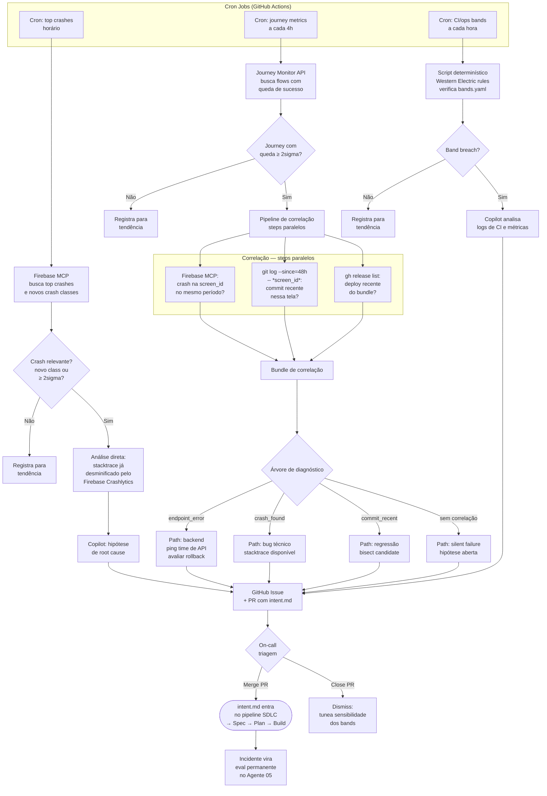

# Agente 07 — Maintain

**Estágio:** Manutenção  
**Runtime:** GitHub Actions (cron) + Firebase MCP + Journey Monitor API + Copilot API  
**Responsável pela aprovação:** On-call engineer (triagem via PR)

> Três camadas de monitoramento autônomo convergem num pipeline de correlação. Problemas de produção são diagnosticados e re-entram no pipeline SDLC formalmente como `intent.md`. O loop se auto-perpetua.

---

## O que muda

Hoje, o ciclo entre "problema em produção" e "fix no código" é reativo e dependente de humano disponível. O on-call recebe um alerta, investiga manualmente, determina a causa, e decide o que fazer — sem rastro formal da investigação.

O Agente 07 automatiza a investigação inicial: ele consulta as fontes de monitoramento, correlaciona os dados, formula uma hipótese de root cause, e entrega para o on-call um pacote de diagnóstico já estruturado — em vez de dados brutos. O on-call decide o que fazer com essa informação. Se decidir que requer fix, o `intent.md` gerado entra no pipeline normal — com rastreabilidade completa.

---

## Pré-requisitos

- Firebase MCP configurado e autenticado nos GitHub Actions runners
- Journey Monitor API acessível com credenciais de serviço nos secrets do GitHub Actions
- `bands.yaml` configurado por bundle com os thresholds relevantes
- Copilot API acessível em modo non-interactive
- `templates/intent.md` disponível para geração automática
- Sourcemaps do bundle enviados ao Firebase Crashlytics em cada release (para desminificação)

---

## Inputs

### Três fontes de monitoramento

#### 1. Firebase Crashlytics (via Firebase MCP)

| Dado | O que o MCP retorna | Como é usado |
|---|---|---|
| Top crashes do período | `crash_id`, `crash_group`, `count`, `affected_users` | Identifica crashes prioritários |
| Crash por grupo | Stacktrace completo (desminificado via Crashlytics) | Base para análise de root cause |
| Novos crash classes | Crashes que não existiam no período anterior | Alerta imediato, independente de threshold |
| Crash rate trend | Taxa de crash vs. baseline (7d rolling) | Input para bands.yaml |

**Desminificação:** O Firebase Crashlytics armazena e aplica sourcemaps automaticamente se o bundle de sourcemaps for enviado durante o deploy. O MCP retorna o stacktrace já desminificado — sem necessidade de etapa adicional no workflow.

#### 2. Journey Monitor (API consultada periodicamente)

| Dado | Endpoint/Formato | Como é usado |
|---|---|---|
| Flows com queda de sucesso | `GET /journeys/metrics?period=24h` | Identifica quais fluxos negociais têm problema |
| Tela problemática | `screen_id` no payload de cada flow afetado | Localiza exatamente onde na jornada o drop ocorre |
| Taxa de queda | `success_rate`, `baseline`, `delta_pct` | Input para bands.yaml (journey metrics) |
| Erros de endpoint | `endpoint_errors[{url, method, status, rate}]` | Primeira correlação — indica backend issue |

#### 3. `bands.yaml` — Métricas de CI/Operação

Arquivo de configuração por bundle que define thresholds e ações:

```yaml
# bands.yaml — [Nome do Bundle]
metrics:
  # Métricas de CI
  - metric: ci_test_failure_rate
    baseline: rolling_30d
    tiers:
      1sigma: { action: log }
      2sigma: { action: diagnose, tools: "read,grep,gh-run-view" }
      3sigma: { action: propose, routes: [pull_request, runbook:rollback-deploy] }

  # Métricas de crash (Firebase)
  - metric: firebase_crash_rate
    baseline: rolling_7d
    source: firebase_mcp
    tiers:
      1sigma: { action: log }
      2sigma: { action: diagnose, tools: "firebase-mcp,gh-issue" }
      3sigma: { action: propose, routes: [intent_md, runbook:rollback-deploy] }

  # Novo crash class — ação imediata, sem baseline
  - metric: firebase_new_crash_class
    baseline: none
    source: firebase_mcp
    tiers:
      any: { action: diagnose, tools: "firebase-mcp,gh-issue,intent_md" }

  # Jornadas negociais (Journey Monitor)
  - metric: journey_success_rate
    by: [flow_id, screen_id]    # granularidade até a tela
    baseline: rolling_7d
    source: journey_monitor
    tiers:
      1sigma: { action: log }
      2sigma: { action: correlate, tools: "firebase-mcp,git-log,gh-release" }
      3sigma: { action: diagnose+intent_md, uses: correlation_pipeline }

  # Dívida de backend — adapters sem implementação real
  - metric: backend_debt
    source: repo_scan          # scan de *ServiceMock.ts sem *ServiceImpl.ts correspondente
    tiers:
      any: { action: log }     # sempre registra — visibilidade do backlog de backend
    report:
      frequency: weekly
      format: |
        features aguardando backend:
          - {feature}: {mock_file} (criado em {date}, endpoint: {endpoint})
```

---

## Output

### 1. GitHub Issue (visibilidade imediata)

Criada automaticamente para qualquer problema que atinge o tier `diagnose` ou superior. Formato:

```markdown
## [CRASH] NullPointerException em ProfileScreen — 847 usuários afetados

**Tipo:** Novo crash class (sem baseline — ação imediata)
**Bundle:** contratacao
**Primeiro detectado:** 2024-01-15 14:32 UTC

### Stacktrace desminificado
```
ProfileScreen.tsx:47 — cannot read property 'validate' of null
  at ProfileScreen.render (ProfileScreen.tsx:47)
  at UserProfileFlow.tsx:23
```

### Hipótese de root cause
`user.profile` retorna null quando usuário não completou onboarding.
A renderização em `ProfileScreen.tsx:47` não tem null check.

### PR com intent.md para fix
👉 #847 (aguardando triagem do on-call)

**Labels:** `crash`, `Important`, `bundle:contratacao`, `auto-generated`
```

### 2. Relatório semanal de dívida de backend

Gerado automaticamente via scan do repo. Identifica features com `*ServiceMock.ts` sem `*ServiceImpl.ts` correspondente — features prontas no frontend aguardando backend real.

```markdown
## Backend Debt Report — [Bundle] — 2024-01-15

### Features aguardando implementação de backend

| Feature | Mock criado em | Endpoint (api-contract.md) | Dias aguardando |
|---|---|---|---|
| `payment` | 2024-01-08 | `POST /api/v1/payment/validate` | 7 |
| `credit-limit` | 2023-12-20 | `GET /api/v2/credit/limit` | 26 |

**Ação sugerida:** Compartilhar com o time de backend para priorização.
**Features prontas para ativar:** Nenhuma neste ciclo (sem ServiceImpl.ts novos desde o último report).
```

Esse relatório é postado como comentário na GitHub issue de rastreamento do sprint e enviado ao release manager como insumo para a decisão de ativação de feature flags.

### 3. PR com `intent.md` (entrada formal no pipeline)

O PR com o `intent.md` rascunhado é a forma de entrar no pipeline SDLC. Formato do `intent.md` gerado:

**Para crash (Firebase):**
```markdown
---
title: "Fix: NullPointerException em ProfileScreen ao renderizar perfil incompleto"
source_card: "github-issue:#847"
source_type: firebase_crash
crash_id: "crash_group_abc123"
affected_users: 847
bundle: contratacao
author: copilot-maintain-agent
created_at: "2024-01-15"
template_version: "1.0"
---

## Problema

NullPointerException em `ProfileScreen.tsx:47` quando `user.profile` é null.
O erro ocorre para usuários que iniciaram o onboarding mas não o completaram —
o estado intermediário não é tratado pela tela de perfil.

## Outcome Esperado

- NullPointerException eliminado: crash rate do grupo retorna a 0 em 48h após o fix
- Tela de perfil renderiza corretamente para usuários com perfil incompleto (estado intermediário tratado)

## Usuários Afetados

- Segmento: usuários PF com onboarding incompleto (bundle contratacao)
- Volume: 847 na última semana (novo crash class — potencial de crescimento)

## Sistemas Envolvidos

- `bundle-contratacao` — `ProfileScreen.tsx` (arquivo com o erro)
- `UserProfileFlow` — componente pai que passa `user.profile` para a tela

## Constraints

- Fix deve preservar o comportamento atual para usuários com perfil completo
- Não requer mudança de backend — problema é no tratamento de estado no frontend

## Perguntas Abertas

1. Qual é o estado visual correto para usuários com perfil incompleto?
   (Skeleton? EmptyState? Redirect para completar onboarding?)
2. Há outros pontos no bundle que fazem o mesmo null access sem tratamento?

## Evidências

- Stacktrace desminificado: `ProfileScreen.tsx:47`
- Primeiro detectado: 2024-01-15 14:32 UTC
- Commits recentes em `ProfileScreen.tsx`: abc123 (2 dias atrás)
```

**Para falha de jornada (Journey Monitor):**
```markdown
---
title: "Investigar: queda de 34% na conclusão do fluxo de contratação de crédito"
source_card: "journey-monitor:contratacao-credito"
source_type: journey_monitor
flow_id: contratacao-credito
problematic_screen: ConfirmacaoDadosScreen
success_rate_drop: -34%
diagnosis_path: endpoint_error
bundle: contratacao
author: copilot-maintain-agent
created_at: "2024-01-15"
---

## Problema

Taxa de conclusão do fluxo `contratacao-credito` caiu 34% nas últimas 24h.
A tela problemática identificada é `ConfirmacaoDadosScreen`.

**Correlação realizada:**
- **Erros de endpoint:** `POST /api/v2/credit/validate` com 12% de taxa de erro 503 ✅
- **Crashes Firebase:** nenhum na `ConfirmacaoDadosScreen` no mesmo período ➖
- **Commit recente na tela:** `abc123` — "feat: atualiza validação de crédito" (2d atrás) ✅
- **Deploy recente:** `v2.4.1` (3 dias atrás, bundle contratacao) ✅

**Diagnóstico (árvore de correlação — path: endpoint_error):**
O endpoint `/api/v2/credit/validate` retornando 503 é a causa mais provável.
O commit `abc123` e o deploy `v2.4.1` são candidatos a terem introduzido a regressão.

## Outcome Esperado

- Taxa de conclusão do fluxo retorna ao baseline (≥ 95%) em 48h após o fix
- Endpoint `/api/v2/credit/validate` sem erros 503

[...restante do intent.md no template padrão...]
```

---

## Fluxo



---

## Evals

### Por que evals para este agente

O Agente 07 toma decisões com consequências reais: gera issues e PRs que o on-call precisa triar. Falsos positivos desgastam o on-call. Diagnósticos incorretos levam a ações erradas. A árvore de diagnóstico é o que torna o comportamento testável — cada branch tem inputs e outputs previsíveis.

### Estrutura de uma task de eval

```
agents/07-maintain/evals/tasks/
├── task-001-crash-new-class/          # branch: Firebase novo crash class
├── task-002-crash-rate-spike/         # branch: Firebase crash rate 3sigma
├── task-003-journey-endpoint-error/   # branch: endpoint_error
├── task-004-journey-crash-corr/       # branch: crash_found via correlação
├── task-005-journey-commit-corr/      # branch: commit_recent
├── task-006-journey-no-correlation/   # branch: sem correlação (silent failure)
└── task-007-duplicate-crash/          # caso especial: crash já aberto
```

**Estrutura de uma task (exemplo: journey com endpoint error):**
```
task-003-journey-endpoint-error/
├── input/
│   ├── journey_signal.json      # payload do Journey Monitor para este caso
│   ├── firebase_response.json   # resposta simulada do Firebase MCP (sem crash)
│   ├── git_log.txt              # git log dos últimos 48h na tela
│   └── gh_releases.json         # releases recentes do bundle
└── expected/
    ├── diagnosis_path.txt        # "endpoint_error" — o path esperado
    ├── intent_md.md              # intent.md esperado (ground truth)
    ├── github_issue.md           # issue esperada
    └── validation.json           # regras de validação para o grader
```

**`journey_signal.json`** — simula o input do Journey Monitor:
```json
{
  "flow_id": "contratacao-credito",
  "screen_id": "ConfirmacaoDadosScreen",
  "success_rate": 0.61,
  "baseline_7d": 0.95,
  "delta_pct": -35.8,
  "endpoint_errors": [
    {
      "url": "/api/v2/credit/validate",
      "method": "POST",
      "status": 503,
      "error_rate": 0.12
    }
  ],
  "period_start": "2024-01-15T00:00:00Z",
  "period_end": "2024-01-15T12:00:00Z"
}
```

**`validation.json`** — regras do grader code-based:
```json
{
  "intent_md": {
    "required_fields": ["flow_id", "problematic_screen", "diagnosis_path",
                        "success_rate_drop", "correlation"],
    "diagnosis_path_must_be": "endpoint_error",
    "must_mention_endpoint": "/api/v2/credit/validate",
    "must_mention_commit_or_deploy": true
  },
  "github_issue": {
    "must_have_label": ["journey-failure", "Important"],
    "must_link_pr": true
  },
  "sla_minutes": 30
}
```

### Tipos de graders

#### Code-based

```python
# graders/maintain_validation.py
import yaml, json, re
from datetime import datetime

def grade(outputs: dict, validation_rules: dict, start_time: datetime) -> dict:
    intent_md = outputs.get('intent_md', '')
    github_issue = outputs.get('github_issue', '')
    results = {}

    # 1. Campos obrigatórios no intent.md
    frontmatter = yaml.safe_load(intent_md.split('---')[1]) if '---' in intent_md else {}
    required = validation_rules['intent_md']['required_fields']
    results['missing_fields'] = [f for f in required if not frontmatter.get(f)]

    # 2. diagnosis_path correto?
    expected_path = validation_rules['intent_md'].get('diagnosis_path_must_be')
    results['correct_diagnosis_path'] = frontmatter.get('diagnosis_path') == expected_path

    # 3. Endpoint mencionado (para casos de endpoint_error)?
    if endpoint := validation_rules['intent_md'].get('must_mention_endpoint'):
        results['endpoint_mentioned'] = endpoint in intent_md

    # 4. Commit/deploy mencionado quando deve?
    if validation_rules['intent_md'].get('must_mention_commit_or_deploy'):
        results['commit_or_deploy_mentioned'] = (
            re.search(r'commit|abc\d+|deploy|v\d+\.\d+', intent_md, re.IGNORECASE) is not None
        )

    # 5. Duplicate check — agente abriu issue para crash já existente?
    results['is_duplicate'] = 'duplicate' in github_issue.lower()
    # (não deve ser duplicate se o input é um novo crash)

    # 6. SLA de geração
    elapsed_minutes = (datetime.now() - start_time).seconds / 60
    results['within_sla'] = elapsed_minutes <= validation_rules.get('sla_minutes', 30)

    # 7. GitHub issue tem labels corretas
    expected_labels = validation_rules.get('github_issue', {}).get('must_have_label', [])
    results['correct_labels'] = all(label.lower() in github_issue.lower()
                                    for label in expected_labels)

    results['passed'] = (
        not results['missing_fields'] and
        results['correct_diagnosis_path'] and
        results.get('endpoint_mentioned', True) and
        results.get('commit_or_deploy_mentioned', True) and
        not results['is_duplicate'] and
        results['within_sla'] and
        results['correct_labels']
    )
    return results
```

#### Model-based

```
Avalie o diagnóstico gerado pelo Maintain Agent.

Sinal de entrada: {input_signal}
Correlation bundle: {correlation_data}
intent.md gerado: {intent_md}
GitHub issue gerada: {github_issue}
Diagnóstico esperado (ground truth): {expected_diagnosis}

Critérios (1-5):

1. PLAUSIBILIDADE DA HIPÓTESE (1-5)
   A hipótese de root cause é plausível dado o correlation bundle?
   1 = hipótese não suportada pelos dados | 5 = hipótese bem fundamentada em evidências

2. ACIONABILIDADE (1-5)
   O on-call consegue agir com base no intent.md sem investigação adicional?
   1 = muito vago para agir | 5 = ação clara e específica

3. PROPORCIONALIDADE (1-5)
   A severity e urgência propostas são proporcionais ao impacto real?
   1 = muito alarmista ou muito suave | 5 = proporcional ao impacto

4. AUSÊNCIA DE HALLUCINATION (pass/fail)
   O agente inventou informações não presentes no correlation bundle?
   fail = informações inventadas; pass = apenas dados presentes nos inputs
```

**O critério 4 (ausência de hallucination) é binário e eliminatório** — qualquer informação inventada desqualifica o diagnóstico, independente das outras notas.

### Como rodar

```bash
npm run eval -- --agent=07-maintain
```

Para testar um branch específico da árvore de diagnóstico:
```bash
npm run eval -- --agent=07-maintain --tags=journey,endpoint_error
```

### Criando tasks para novos incidentes

Para cada incidente real que o Agente 07 diagnosticou (corretamente ou não):
1. Salvar o payload das fontes de monitoramento no momento do incidente
2. Documentar o diagnóstico correto (confirmado pelo post-mortem)
3. Criar a task com esses dados como ground truth
4. Se o agente diagnosticou incorretamente: criar a task com o output incorreto como "must not produce" e o correto como "expected"

---

## Governança

### Quem tria e com qual autoridade

**On-call engineer** — tem autoridade para decidir:
- **Merge do PR de `intent.md`**: problema real que precisa de fix → entra no pipeline SDLC
- **Close do PR**: falso positivo, problema já conhecido, ou dismiss temporário
- **Comentário no PR antes de close**: documentar por que foi descartado (para tunar os bands)

O on-call NÃO precisa investigar do zero — o `intent.md` e a GitHub issue já contêm o diagnóstico. A decisão é sobre prioridade e ação, não sobre investigação.

### Mecanismo de dismiss e tuning dos bands

Quando o on-call fecha um PR com dismiss:
1. Adiciona label `dismiss` + razão ao PR (ex: `dismiss:known-issue`, `dismiss:false-positive`)
2. Um workflow processa o dismiss e atualiza o `bands.yaml`:
   - `dismiss:known-issue` → aumenta o threshold para aquele `metric + by` específico por 7 dias
   - `dismiss:false-positive` → registra para revisão trimestral dos thresholds
3. O histórico de dismisses é agregado para calibrar os bands periodicamente

```yaml
# Exemplo de tuning automático após dismiss
# bands.yaml após dismiss de crash group ABC123 por 2x em 1 semana:
- metric: firebase_crash_rate
  filter: { crash_group: "ABC123" }
  snooze_until: "2024-01-22"  # snooze por 7 dias
  dismiss_count: 2
  dismiss_reason: "known-issue - aguardando fix da API"
```

### Separação de funções

O Maintain Agent não pode:
- Fazer merge do próprio PR de `intent.md`
- Fechar a GitHub issue que criou (deve ser o on-call)
- Modificar o `bands.yaml` diretamente (tuning é via workflow controlado)

Qualquer ação de escrita (criar issue, abrir PR) é logada com a identidade do bot de CI — não anônima.

### Incidentes de produção → evals permanentes

Todo incidente que passou pelo Agente 07:
- Se diagnosticado corretamente → a task entra na suite como "caso de sucesso"
- Se diagnosticado incorretamente → a task entra como "caso de regressão" com o output correto como ground truth
- O post-mortem deve sempre resultar em uma task de eval — "não pode acontecer de novo sem ser detectado"

---

## Medição

### Métricas Leading

#### Tempo de detecção → `intent.md` na fila do on-call

- **Por que foi escolhida**: O valor do Maintain Agent está em velocidade. Se o pipeline de correlação demora 2 horas para gerar o `intent.md`, o on-call já investigou manualmente e o agente perdeu a oportunidade de ajudar. O SLA de 30 minutos garante que o agente é mais rápido que a investigação manual.
- **O que indica quando sobe**: Pipeline de correlação lento (queries demoradas no Firebase MCP ou Journey Monitor API), ou filas de CI sobrecarregadas.
- **Como medir**:
  ```bash
  # Timestamp do sinal de monitoramento → timestamp do PR de intent.md aberto
  gh pr list --label "auto-generated,maintain" --json createdAt,title \
    | jq '[.[] | {pr: .title, created: .createdAt}]'
  # Comparar com o timestamp do sinal (em bands.yaml log ou no payload da issue)
  ```
- **Frequência**: Por incidente; P50 e P95 mensais
- **Target**: P50 < 15min, P95 < 30min | Alarme: P50 > 30min

#### Proporção de `diagnosis_path` corretos (validado pelo on-call)

- **Por que foi escolhida**: Se o on-call frequentemente discorda da hipótese do agente ao fazer a triagem, a árvore de diagnóstico não está calibrada. Esse sinal antecipa uma degradação na confiança do on-call no agente.
- **Como medir**: On-call adiciona label ao PR ao fechar: `correct-diagnosis` ou `wrong-diagnosis`. Proporção de `correct-diagnosis` / total de PRs triados.
- **Frequência**: Semanal
- **Target**: > 80% | Alarme: < 60%

### Métricas Lagging

#### Taxa de incidentes de produção que repetem dentro de 30 dias (por classe)

- **Por que foi escolhida**: A meta do ciclo de Maintain é que cada incidente resulte em um fix permanente. Se o mesmo tipo de problema reaparece dentro de 30 dias, ou o fix não foi implementado, ou foi implementado incorretamente. Queda de -50% em 6 meses é o target de impacto.
- **O que indica quando sobe**: Incidentes sem fix (intent.md criado mas não virou PR de fix), ou fix implementado incorretamente (o Agente 04 não endereçou o root cause real).
- **Como medir**:
  ```
  Repeat rate = Incidentes da mesma classe em 30d / Total de incidentes da classe
  Grupos por classe: mesmo crash group, mesmo flow_id + screen_id, mesma band breach
  ```
  Fonte: GitHub issues com label `crash` ou `journey-failure`, agrupadas por label de classe
- **Frequência**: Mensal; tendência de 6 meses
- **Target**: < 20% de repeat rate por classe | Alarme: > 40%

#### Dívida de backend — features aguardando implementação

- **Por que foi escolhida**: Mede o tamanho do backlog de features prontas no frontend mas sem backend real. Crescimento constante indica que o time de backend está subutilizando o `api-contract.md` como documento de handoff — ou que não há priorização do backlog de serviços.
- **O que indica quando sobe**: Muitas features sendo liberadas com mocks, sem plano de backend correspondente. Ação: compartilhar relatório com time de backend e product owner para priorização.
- **Como medir**:
  ```bash
  # Conta ServiceMock sem ServiceImpl no repo
  find services/ -name '*ServiceMock.ts' | while read mock; do
    impl="${mock/ServiceMock/ServiceImpl}"
    [ ! -f "$impl" ] && echo "$mock"
  done | wc -l
  ```
- **Frequência**: Semanal (incluído no relatório de dívida)
- **Target**: nenhum valor absoluto — monitorar tendência; crescimento > 5 features/semana = sinal de desalinhamento

#### `diagnosis_path` correto validado pelo post-mortem (confirmação real vs. hipótese)

- **Por que foi escolhida**: O on-call avalia o diagnóstico em tempo real com informação incompleta. O post-mortem — feito após o fix — confirma qual era o root cause real. Comparar o `diagnosis_path` com o root cause do post-mortem é a validação definitiva da qualidade do diagnóstico.
- **Como medir**: Campo `diagnosis_path` no frontmatter do `intent.md` vs. campo `actual_root_cause` preenchido no post-mortem
  ```bash
  # PRs de intent.md com post-mortem documentado
  gh pr list --label "maintain,post-mortem" --json body \
    | jq '[.[] | {
        diagnosis: (.body | match("diagnosis_path: (.+)").captures[0].string),
        actual: (.body | match("actual_root_cause: (.+)").captures[0].string)
      }]'
  ```
- **Frequência**: Trimestral (requer post-mortems documentados)
- **Target**: ≥ 75% de diagnósticos corretos confirmados | Alarme: < 50%
