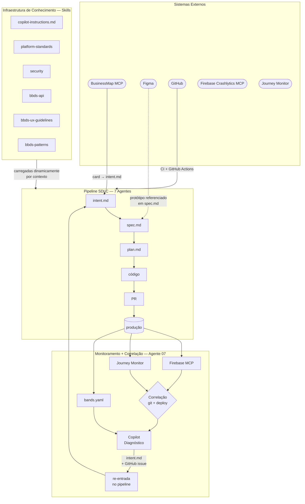

# Arquitetura do Sistema

## Visão Geral

Este documento descreve como as peças do sistema se conectam: quais sistemas externos são integrados, como o conhecimento chega aos agentes, como os artefatos fluem entre os estágios, e como o monitoramento em produção fecha o loop de volta para o início do pipeline.

A arquitetura tem três camadas que operam simultaneamente:

- **Pipeline SDLC** — a cadeia de 7 artefatos (intent.md → spec.md → plan.md → código → PR → produção) produzida pelos agentes
- **Infraestrutura de Conhecimento** — skills e instruções que dão contexto especializado a cada agente no momento certo
- **Camada de Monitoramento** — detecta problemas em produção e alimenta o pipeline de volta, fechando o loop

---

## Diagrama Geral



### Como ler o diagrama

- **Sistemas Externos (topo)**: ferramentas que a organização já usa — não são criadas para esta esteira, apenas integradas
- **Infraestrutura de Conhecimento (esquerda)**: os arquivos que ensinam os agentes sobre os padrões específicos da plataforma
- **Pipeline SDLC (centro)**: a cadeia de artefatos — o caminho de uma ideia até código em produção
- **Monitoramento + Correlação (baixo)**: o que acontece após o deploy — o loop de retorno
- **Setas sólidas (→)**: dados que fluem ativamente entre os componentes
- **Setas tracejadas (-.->)**: referências — o sistema é consultado, mas não há integração direta automatizada

---

## Sistemas Externos

Esses sistemas já existem na organização. A esteira os integra sem criar novos sistemas.

### BusinessMap

O BusinessMap é a ferramenta de gestão de backlog da plataforma. Cada funcionalidade começa como um card com: título, descrição do problema, critérios de aceitação, estimativa e metadados do time.

A integração usa um **MCP (Model Context Protocol)** — um protocolo padronizado que permite ao Copilot acessar dados de sistemas externos como se fossem ferramentas nativas da sessão. O BusinessMap MCP já existe e é usado hoje; a esteira o reutiliza sem desenvolvimento adicional.

Através do MCP, o Agente 01 pode:
- Listar cards de um board específico por critérios (sprint, prioridade, time)
- Ler todos os campos de um card: título, descrição, critérios de aceitação, links, comentários
- (Write-back: a confirmar — se disponível, permite mover cards de status automaticamente após o intent.md ser aprovado)

O MCP elimina a necessidade do engenheiro copiar e colar informações do card para o intent.md manualmente. O Agente 01 lê o card e gera o artefato estruturado diretamente.

### Figma

O Figma é a ferramenta de design onde o time de UX cria os protótipos de interface. O fluxo de design visual continua **manual** — UX cria, engenheiros consultam. Não há automação no processo de design em si.

Na esteira, o Figma é usado de duas formas:
1. **Referência no `spec.md`**: o Agente 02 documenta o link do protótipo e mapeia quais componentes BBDS serão usados em cada tela do protótipo
2. **Geração de código** (Agente 04): a skill `figma-to-code` interpreta a estrutura visual da tela para identificar componentes e gerar código inicial, cruzando contra `bbds-api-reference.md` para validar props

Quando dev mode do Figma estiver disponível em escala, um Figma MCP pode ser ativado para leitura estruturada do design (não apenas link de referência, mas dados de componentes e layout).

### GitHub

O GitHub é a infraestrutura central da esteira — o lugar onde todos os artefatos vivem e onde os gates de aprovação acontecem:

- **Repositórios**: todos os artefatos (`intent.md`, `spec.md`, `plan.md`) são arquivos Markdown versionados em git — rastreáveis, diff-áveis, com histórico completo
- **GitHub Actions**: executa os workflows de automação — eval suite, bootstrap de conhecimento, monitoramento contínuo, geração de bbds-api-reference
- **Copilot Code Review** (feature Enterprise): revisa PRs automaticamente usando `REVIEW.md` como rubrica — 4 passes (bugs, segurança, conformidade com spec, padrões de plataforma)
- **Branch protection**: enforça os gates de aprovação — 1 humano + CI green = obrigatórios para merge
- **GitHub environments**: gerenciam aprovação de deploy com aprovadores nomeados (release manager para produção)
- **GitHub issues**: destino dos alertas de incidente gerados pelo Agente 07 — visibilidade imediata para o on-call

### Firebase Crashlytics

O Firebase Crashlytics é a ferramenta de monitoramento de crashes técnicos do app mobile. Quando o app crasha em produção, o Crashlytics captura o stacktrace (sequência de chamadas de função que levou ao crash), o contexto do dispositivo (OS, versão, modelo) e a frequência do erro entre usuários.

O problema com apps React Native: o código em produção é minificado e empacotado — os stacktraces apontam para linhas de arquivos gerados, não para os arquivos de código-fonte originais. A **desminificação** é o processo de traduzir esses apontamentos de volta para os arquivos e linhas originais usando source maps.

A integração usa um **Firebase MCP** existente. O Agente 07 usa esse MCP para:
1. Buscar os top crashes do período (por frequência de ocorrência ou percentual de usuários afetados)
2. Acessar o stacktrace completo de cada crash
3. Desminificar o stacktrace usando os source maps do build correspondente
4. Ter o arquivo e linha exatos do crash — sem que o engenheiro precise abrir o painel do Firebase

O resultado é um diagnóstico de root cause automatizado: o Agente 07 sabe o que quebrou, onde, e com qual frequência — antes que o on-call precise investigar manualmente.

**Solução existente, estendida:** a integração Firebase MCP → diagnóstico → GitHub issue já existe. A esteira a estende para também gerar um `intent.md` — dando ao incidente entrada formal no pipeline SDLC para resolução estruturada.

### Journey Monitor

O Journey Monitor é uma ferramenta interna que analisa dados de navegação do app para detectar quando usuários não completam fluxos negociais importantes.

**Como funciona:** para cada fluxo de negócio (ex: "solicitar portabilidade", "fazer um PIX", "ativar cartão"), a ferramenta define qual é a **tela de sucesso** — a última tela que o usuário deve alcançar para o fluxo ser considerado concluído. O monitor acompanha continuamente qual proporção de usuários que iniciam um fluxo alcança a tela de sucesso.

Quando essa proporção cai abaixo de um limiar estatístico (calculado sobre a média histórica), a ferramenta detecta uma anomalia e sabe:
- **Qual fluxo** está com problema (`flow_id`)
- **Qual tela** no funil tem queda de navegação (`screen_id`) — não apenas "o fluxo X tem problema", mas "a tela `ConfirmacaoDadosScreen` tem 34% menos navegações que o baseline dos últimos 7 dias"
- **Se há erro de endpoint** naquele fluxo — se uma chamada de API está retornando erros, isso é correlacionado com a queda

A granularidade até o `screen_id` é o diferencial crítico: ela permite cruzar o sinal com dados de git (commits que tocaram aquele arquivo) e Firebase (crashes naquela tela), tornando a correlação precisa.

---

## Infraestrutura de Conhecimento — Skills

Skills são o mecanismo central para dar contexto especializado aos agentes. Sem skills, o Copilot tem conhecimento geral de React Native — mas não conhece os padrões específicos desta plataforma, esta versão do BBDS, ou estas regras de segurança.

### O que é uma skill e como é carregada

Uma skill é um arquivo Markdown no formato SKILL.md, armazenado em `.github/skills/` no repositório. Cada skill tem um campo `description` que é a chave do carregamento dinâmico:

```markdown
---
name: bbds-api
description: "Especificação completa da API dos componentes BBDS — props, tipos,
              valores default, props deprecated e migration paths para a versão atual."
---

## Button

| Prop | Tipo | Default | Obrigatório |
|---|---|---|---|
| `variant` | `"primary" \| "secondary" \| "ghost"` | `"primary"` | não |
| `onPress` | `() => void` | — | **sim** |
| `disabled` | `boolean` | `false` | não |

### ~~`color`~~ (deprecated desde v3.1)
Usar `variant` no lugar. `color="blue"` → `variant="primary"`.
```

O GitHub Copilot Enterprise lê os `description` de todas as skills disponíveis a cada sessão. Quando o contexto menciona "componente BBDS" ou "Button" ou "prop", a skill `bbds-api` é carregada. Quando menciona "autenticação" ou "token" ou "biometria", a skill `security` é carregada. O engenheiro não precisa buscar documentação manualmente — o contexto certo aparece na sessão.

**Por que não deixar o Copilot buscar a documentação?** O Copilot poderia usar busca na web ou em Confluence. Mas documentação externa pode estar desatualizada, pode não ter o conteúdo exato, e o resultado de uma busca é imprevisível — o chunk certo pode não ser retornado. Skills são determinísticas: o conteúdo exato que o agente recebe é conhecido, versionado em git, e testado em evals.

### `copilot-instructions.md` — a camada sempre carregada

Além das skills (carregadas por contexto), o `copilot-instructions.md` é sempre presente — carregado em toda sessão do Copilot naquele repositório. Ele contém o contexto fundamental que qualquer agente naquele bundle precisa:

- Estrutura de pastas e onde criar cada tipo de arquivo
- Comandos para rodar testes, lint, e build localmente
- Allowlist de dependências aprovadas (e quais não usar)
- Padrões de nomenclatura (PascalCase para componentes, camelCase para hooks)
- Referências para as skills disponíveis e quando cada uma é relevante
- Regras absolutas (ex: "NUNCA altere arquivos de teste para fazer um teste passar")

### Tabela de skills e origem

| Skill | Origem | Conteúdo | Carregada quando |
|---|---|---|---|
| `platform-standards` | **Fase 0** — curada pela plataforma | Convenções de código, arquitetura de bundle, anti-patterns documentados com exemplos | Qualquer implementação no stack |
| `security` | **Fase 0** — curada pelo time de segurança | OWASP React Native, secure storage, cert pinning, padrões de autenticação | Features com autenticação, dados sensíveis |
| `bbds-api` | **Fase 0b** — **auto-gerada via ts-morph** | Props, tipos, defaults, deprecated + migration paths da versão atual | Qualquer menção a componente BBDS |
| `bbds-ux-guidelines` | **Fase 0b** — curada pelo time de UX | Quando usar / não usar cada componente; combinações corretas e incorretas | Decisões de UX, seleção de componentes |
| `bbds-patterns` | **Fase 0b** — curada pela plataforma | Padrões de composição de telas; hierarquia de componentes; exemplos validados | Geração de nova tela ou fluxo |

**Auto-geração da `bbds-api`:** o script `extract-bbds-types.ts` usa a biblioteca `ts-morph` para ler os TypeScript types do BBDS diretamente do código-fonte. `ts-morph` é uma biblioteca que permite analisar programaticamente TypeScript — ela lê as declarações de tipos, props, valores default (a partir de `defaultProps` ou do tipo), e comentários JSDoc (`@deprecated`, `@default`, descrições). O resultado é um arquivo Markdown estruturado. Esse processo roda automaticamente em CI cada vez que a versão do BBDS muda no `package.json` — sem lag entre release e documentação.

---

## Cadeia de Artefatos

Cada artefato é um arquivo Markdown versionado em git. Nenhum estágio começa sem o artefato anterior aprovado via merge de PR.

O que cada artefato contém, o que cada gate de aprovação significa, e o que seria diferente sem ele:

```
BusinessMap card
    │
    │  [Agente 01 lê via BusinessMap MCP]
    ▼
intent.md ──── O QUÊ e o POR QUÊ.
               Problema em linguagem de negócio: outcome esperado para o usuário,
               usuários afetados, métricas de sucesso esperadas, constraints já
               conhecidas (técnicas ou de negócio), perguntas abertas que precisam
               de resposta antes de implementar.
               NÃO contém: como implementar, quais componentes usar.
    │
    │  Gate: Product Owner faz merge do PR
    │  Pergunta: "Este é o problema certo a resolver? A prioridade está correta?
    │             O outcome esperado faz sentido?"
    │  Sem esse gate: implementar a solução errada para o problema errado.
    ▼
spec.md ─────── O QUÊ detalhado.
                Requisitos funcionais (o que o sistema deve fazer) e não-funcionais
                (desempenho, segurança, acessibilidade). Critérios de aceitação
                testáveis. Telas mapeadas com componentes BBDS específicos.
                Flags de compliance: 🔴 Important (bloqueante) e 🟡 Warning (a endereçar).
                NÃO contém: plano de implementação técnica.
    │
    │  Gate: PO + policy owners (segurança, compliance, UX)
    │  Pergunta: "Os requisitos estão corretos? As flags foram endereçadas pelos
    │             donos das políticas?"
    │  Sem esse gate: implementar com violação de compliance descoberta só no code review.
    ▼
plan.md ─────── O COMO.
                Lista exata de arquivos a criar/modificar. Ordem de trabalho sequencial.
                Riscos técnicos identificados e como mitigá-los. Estratégia de testes
                (quais cenários de sucesso e falha cobrir). Critérios de "pronto".
                NÃO contém: código — apenas a estratégia de implementação.
    │
    │  Gate: Engenheiro responsável commita explicitamente
    │  Pergunta: "Esta estratégia é viável? Os riscos foram identificados?
    │             A ordem de trabalho faz sentido?"
    │  Sem esse gate: implementação que descobre no meio que a abordagem não funciona.
    ▼
código ──────── A implementação.
                Guiada pelo plan.md item por item. Tests gerados junto com o código.
                Props BBDS validadas contra bbds-api-reference.md.
                Lint e testes passando localmente antes do push.
    │
    │  Gate: CI green
    │  Verificações: npm test, lint, evals do agente (se config foi alterada)
    │  Sem esse gate: código com bugs ou prop BBDS incorreta chega ao review humano.
    ▼
PR ─────────── O diff completo.
               Copilot Code Review analisa 4 passes: bugs/logic errors, segurança,
               conformidade com spec.md/plan.md, padrões de plataforma.
               Findings postados como comentários inline com severidade e sugestão de fix.
    │
    │  Gate: Copilot Code Review sem Important findings + 1 humano aprova
    │  Sem esse gate: bugs sistemáticos passam; padrões violados sem detecção.
    ▼
produção ───── Deploy escalonado:
               Dev: automático após CI
               Staging: automático após merge (validação antes de prod)
               Prod: aprovação do release manager via GitHub environment protection
```

---

## Camada de Monitoramento — Pipeline de Correlação

O sistema de monitoramento fecha o loop: problemas detectados em produção re-entram no pipeline como novos `intent.md`.

### Dois tipos de problema, duas ferramentas

| Tipo | Ferramenta | Sinal | Causa conhecida? |
|---|---|---|---|
| **Crash técnico** | Firebase Crashlytics | Stacktrace + frequência de ocorrência | Sim — arquivo:linha no stacktrace |
| **Falha de jornada** | Journey Monitor | Queda na taxa de conclusão de um fluxo | Não — pode ser crash, endpoint, regressão ou lógica |

A diferença fundamental entre os dois tipos determina como o Agente 07 trata cada um.

Para crashes, o caminho é direto: Firebase MCP → desminificação do stacktrace → root cause em arquivo:linha → diagnóstico → intent.md. A causa é identificável mecanicamente.

Para falhas de jornada, o mesmo sintoma (queda na taxa de conclusão do fluxo X) pode ter causas completamente diferentes: um crash na tela problemática, um endpoint retornando erro, um commit recente que introduziu regressão, ou um bug de lógica silencioso que não gera crash. Sem correlação, o Copilot receberia apenas "a taxa caiu 34%" e precisaria especular a causa — gerando hipóteses não fundamentadas.

### O pipeline de correlação — passo a passo

A correlação é um conjunto de etapas **determinísticas** que rodam **antes** da análise do Copilot. Ela reúne contexto de múltiplas fontes automaticamente:

**Sinal de entrada (do Journey Monitor):**
```
flow_id: portabilidade
screen_id: ConfirmacaoDadosScreen
queda: 34% abaixo do baseline dos últimos 7 dias
endpoint_errors: [] (nenhum erro de endpoint detectado)
period: 2024-01-15T08:00Z → 2024-01-15T14:00Z
```

**Passos do pipeline (paralelos):**

```
Step 1: Firebase MCP
  → Houve crash em ConfirmacaoDadosScreen entre 08:00 e 14:00?
  → Resultado: CRASH_FOUND: task_001, TypeError em validacao.ts:47, 89 ocorrências

Step 2: git log
  → git log --oneline --follow -- "*ConfirmacaoDadosScreen*" --since="24h ago"
  → Resultado: COMMIT_FOUND: abc123 "fix: validação de CPF" há 6h (autor: joão)

Step 3: gh release list
  → Deploys do bundle portabilidade nas últimas 24h?
  → Resultado: DEPLOY_FOUND: v2.4.1 há 8h
```

**Bundle de correlação entregue ao Copilot:**

O Copilot não recebe o sinal bruto — recebe o bundle completo: o sinal original + todos os resultados de correlação. Com esse contexto, segue a árvore de diagnóstico predefinida.

### Árvore de diagnóstico

```
Falha de jornada detectada
    │
    ├── endpoint_error presente no sinal do Journey Monitor?
    │     SIM → Problema de backend
    │           → Ação: ping time de API, avaliar rollback de endpoint
    │           → intent.md direcionado para o time responsável pelo endpoint
    │
    ├── crash_found no Firebase na mesma tela/período?
    │     SIM → Bug técnico (causa identificada via stacktrace)
    │           → Stacktrace já desminificado disponível
    │           → intent.md de bug + GitHub issue com stacktrace e arquivo:linha
    │
    ├── commit_recent toca a tela problemática?
    │     SIM → Regressão provável
    │           → Candidato a git bisect, avaliar rollback do commit
    │           → intent.md de regressão com commit referenciado e autor notificado
    │
    └── nenhum sinal correlacionado
          → Silent failure (bug de lógica ou UX)
          → Investigação com session recording
          → intent.md com hipótese aberta + todas as evidências coletadas
```

Cada branch é testável em evals com casos históricos conhecidos — não seria possível criar evals se a análise fosse livre (sem árvore predefinida).

### Configuração dos limiares — `bands.yaml`

O `bands.yaml` define quando cada sinal aciona cada tipo de resposta, usando desvios-padrão (σ) sobre a média histórica (critério estatístico das Western Electric Rules):

```yaml
- metric: journey_success_rate
  by: [flow_id, screen_id]
  baseline: rolling_7d           # média dos últimos 7 dias como referência
  tiers:
    1sigma: { action: log }                        # registra, não alerta
    2sigma: { action: correlate }                  # roda pipeline de correlação
    3sigma: { action: diagnose+intent_md }         # diagnóstico completo + PR com intent.md

- metric: crash_rate
  by: [bundle_version, screen_id]
  baseline: rolling_7d
  tiers:
    1sigma: { action: log }
    2sigma: { action: github_issue }
    3sigma: { action: github_issue+intent_md }
```

**Mecanismo de dismiss e auto-tuning:** quando o on-call fecha um intent.md gerado como falso positivo, o sistema registra o sinal como ruído para aquela combinação específica de `flow_id` + `screen_id`. Após N dismisses do mesmo sinal, o `bands.yaml` pode ser ajustado automaticamente para aumentar o limiar — evitando alertas repetidos sem ação.

### Dois outputs independentes do trigger

Independente da fonte (crash, jornada, ou CI), o Agente 07 sempre gera:

1. **GitHub issue** — visibilidade imediata para o on-call, com sumário do sinal e hipótese de diagnóstico
2. **PR com `intent.md`** — entrada formal no pipeline SDLC para correção estruturada

On-call decide: merge do PR (o incidente entra no pipeline como feature de correção) ou close com dismiss (o sinal é configurado para não repetir).

---

## GitHub Copilot Enterprise — Mapeamento de Capacidades

Para quem conhece o playbook da Anthropic ou o Claude Code, a tabela abaixo mostra como os conceitos mapeiam para o GitHub Copilot Enterprise:

| Conceito Anthropic / Claude Code | Equivalente Copilot Enterprise | Como funciona na prática |
|---|---|---|
| `CLAUDE.md` | `.github/copilot-instructions.md` | Mesmo propósito: contexto sempre carregado em toda sessão. Mesmo conteúdo. |
| Skills | `.github/skills/` (SKILL.md) | **Formato idêntico** — skills escritas para o Copilot funcionam no Claude Code sem modificação |
| Plan Mode | Plan Mode nativo do Copilot | O agente escreve um plano antes de executar — visível para o engenheiro aprovar ou ajustar |
| Subagents | `runSubAgent` (`#tool:agent/runSubagent`) | O agente delega subtarefas para outro agente especializado; equivalente funcional direto |
| Hooks (pre/post) | GitHub Actions + git hooks (husky/lefthook) | O Copilot não tem hook system nativo; GitHub Actions substitui para triggers de CI |
| PR Review | Copilot Code Review (Enterprise) | Feature nativa do Copilot Enterprise; configurada por `REVIEW.md` em cada repo |

**Portabilidade de skills:** o formato SKILL.md é compartilhado entre Copilot Enterprise e Claude Code. Skills escritas neste projeto funcionam em ambos os runtimes — se a organização mudar de runtime no futuro, nenhuma skill precisará ser reescrita.
